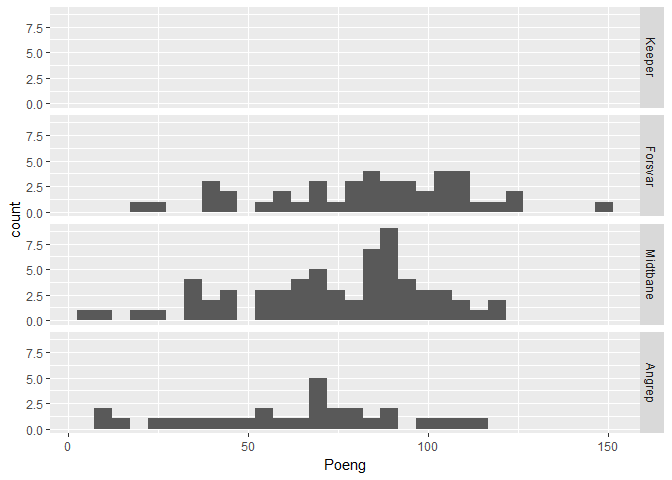
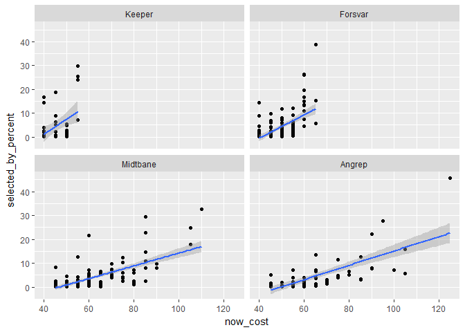
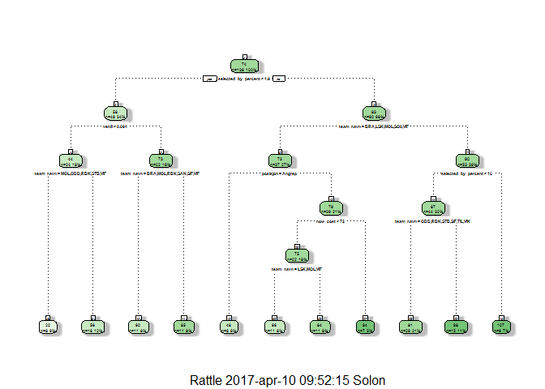
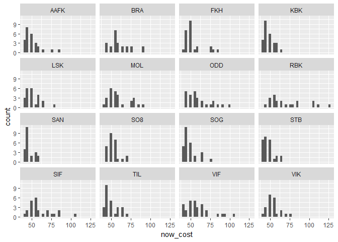
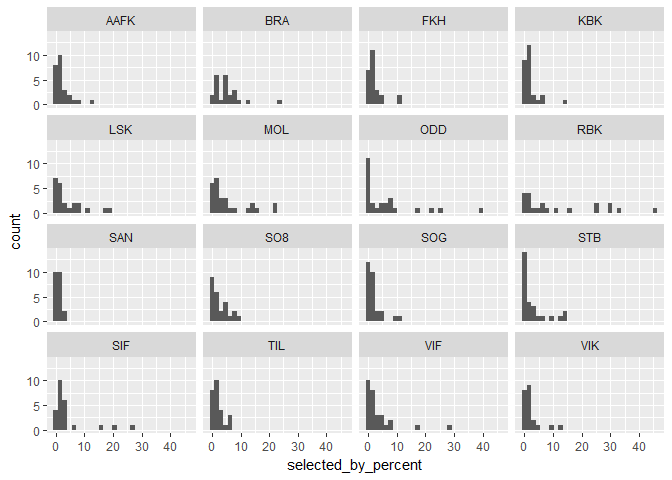
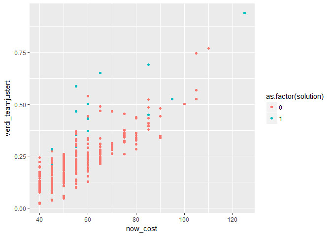

Eliteserien Fantasy Football med R - lagutvelging
================

Hva gjør du når kjentfolk inviterer deg til Eliteserien Fantasy Football, når Solskjær var stor i Norge sist du interesserte deg for norsk ligafotball? Prøver å analysere deg fram til noe fornuftig, selvsagt.

Målet med spillet er å maksimere antallet poeng, ved å velge spillerne som gir deg flest mulig poeng totalt. Spillere mottar poeng utifra spilletid, mål scort, målgivende pasning, og for å holde nullen. Forsvarsspillere får flere poeng for å holde nullen og score mål. Kort, selvmål, straffemiss og mange baklengsmål gir minuspoeng. Se poengsystemet på [hjelpesida](https://fantasy.vg.no/a/help) for mer info.

Første utfordring er å sette sammen et fornuftig lag. En må velge 15 spillere (fordelt på 2 keepere, 5 forsvarsspillere, 5 midtbanespillere og tre angrepsspillere), verdien kan ikke overstige 100 fantasimillioner (fantasillioner?), og en kan maks velge tre spillere fra et enkelt lag. Alt [i følge reglene](https://fantasy.vg.no/a/help).

Det vil antakeligvis være strategiske valg involvert i hvilke deler av laget en prioriterer høyest - gir det flere poeng å ha en solid keeper og et solid forsvar, eller gode angrepsspillere? Er det bedre med et par dyre spillere og mange billige, eller at alle er omlag jevngode (erfaringer fra [Premier League](http://pena.lt/y/2015/08/07/mathematically-optimising-fantasy-football-team-redux/) tyder på det siste)? Er det bedre med dyre enkeltspillere fra middelmådige lag eller middels spillere fra gode lag? Er et godt lag et lag som scorer mange mål eller slipper inn få (hvis den forskjellen gir mening i eliteserien)?

Uansett - dette er et opimeringsproblem med diverse begresninger. Så hvis jeg kan finne datamateriale over alle spillere, deres fantasipengeverdi, posisjon, lagtilhørighet, popularitet og track record for 2016, bør det gå an å sette sammen noe som er ok - eller bedre enn rein gjetning, i hvert fall.

Datagrunnlaget
--------------

Heldigvis liger datagrunnlaget VG bruker tilgjengelig i json-format i et API (?), og kan hentes med GET. API-endepunktene ser ut til å være de samme som i Fantasy Premier League, som bl.a. er lista ut av bobbymond på [GitHub](https://github.com/bobbymond/FantasyPremierLeagueAPI).

Vil VG protestere på slik bruk av dataene? Dette er jo ikke dokumentert noe sted, så vidt jeg ser. Terms of Service omtaler at spillet ikke kan kopieres, men det står ingenting om datagrunnlaget. Siden hver skifting av hvilke spillere som vises utløser et nytt slikt kall, bør ikke et par kall fra denne algoritmen være feil.

Hver enkelt spillers kampoppsett ligger også tilgjengelig, men ettersom henting av alle disse dataene kan være litt mer krevende (og gi et litt flerdimensjonert datasett), så det lar jeg ligge inntil videre. (Jeg ser på deler av det i lagutviklinga [seinere](https://github.com/gardenberg/fantasy_fotball/blob/master/lagutvikling.md))

Dette ga ved første nedlasting i mars et datasett på 400 observasjoner og 50 variabler. Dataene tyder på at en av spillerne er solgt ut av Norge, og derfor ikke lenger er tilgjengelig. Så dette er dermed hele settet av spillere.

Et par dager senere ga det 402 observasjoner - datasettet oppdateres tydeligvis av og til. Derfor la jeg til en dato-variabel for å holde oversikt.

``` r
#de første observasjonene og variabelliste
glimpse(df)
```

    ## Observations: 415
    ## Variables: 51
    ## $ id                           <int> 1, 2, 3, 4, 5, 6, 7, 8, 9, 10, 11...
    ## $ photo                        <chr> "62022.jpg", "124186.jpg", "21865...
    ## $ web_name                     <chr> "Lie", "Vestly Heigre", "Sødergre...
    ## $ team_code                    <int> 2745, 2745, 2745, 2745, 2745, 274...
    ## $ status                       <chr> "a", "a", "a", "a", "a", "a", "a"...
    ## $ code                         <int> 62022, 124186, 218658, 52335, 640...
    ## $ first_name                   <chr> "Andreas", "Pål", "Sondre", "Kaj"...
    ## $ second_name                  <chr> "Lie", "Vestly Heigre", "Sødergre...
    ## $ squad_number                 <int> 1, NA, 32, 6, 5, 2, 4, 22, 3, 37,...
    ## $ news                         <chr> "", "", "", "", "", "", "", "", "...
    ## $ now_cost                     <int> 45, 45, 40, 50, 45, 55, 45, 45, 5...
    ## $ chance_of_playing_this_round <lgl> NA, NA, NA, NA, NA, NA, NA, NA, N...
    ## $ chance_of_playing_next_round <int> NA, NA, NA, NA, NA, NA, NA, NA, N...
    ## $ value_form                   <chr> "0.0", "0.0", "0.0", "0.0", "0.0"...
    ## $ value_season                 <chr> "0.0", "0.0", "0.0", "0.0", "0.0"...
    ## $ cost_change_start            <int> 0, 0, 0, 0, 0, 0, 0, 0, 0, 0, 0, ...
    ## $ cost_change_event            <int> 0, 0, 0, 0, 0, 0, 0, 0, 0, 0, 0, ...
    ## $ cost_change_start_fall       <int> 0, 0, 0, 0, 0, 0, 0, 0, 0, 0, 0, ...
    ## $ cost_change_event_fall       <int> 0, 0, 0, 0, 0, 0, 0, 0, 0, 0, 0, ...
    ## $ in_dreamteam                 <lgl> FALSE, FALSE, FALSE, FALSE, FALSE...
    ## $ dreamteam_count              <int> 0, 0, 0, 0, 0, 0, 0, 0, 0, 0, 0, ...
    ## $ selected_by_percent          <chr> "5.1", "0.6", "3.9", "1.9", "2.2"...
    ## $ form                         <chr> "0.0", "0.0", "0.0", "0.0", "0.0"...
    ## $ transfers_out                <int> 0, 0, 0, 0, 0, 0, 0, 0, 0, 0, 0, ...
    ## $ transfers_in                 <int> 0, 0, 0, 0, 0, 0, 0, 0, 0, 0, 0, ...
    ## $ transfers_out_event          <int> 0, 0, 0, 0, 0, 0, 0, 0, 0, 0, 0, ...
    ## $ transfers_in_event           <int> 0, 0, 0, 0, 0, 0, 0, 0, 0, 0, 0, ...
    ## $ loans_in                     <int> 0, 0, 0, 0, 0, 0, 0, 0, 0, 0, 0, ...
    ## $ loans_out                    <int> 0, 0, 0, 0, 0, 0, 0, 0, 0, 0, 0, ...
    ## $ loaned_in                    <int> 0, 0, 0, 0, 0, 0, 0, 0, 0, 0, 0, ...
    ## $ loaned_out                   <int> 0, 0, 0, 0, 0, 0, 0, 0, 0, 0, 0, ...
    ## $ total_points                 <int> 0, 0, 0, 0, 0, 0, 0, 0, 0, 0, 0, ...
    ## $ event_points                 <int> 0, 0, 0, 0, 0, 0, 0, 0, 0, 0, 0, ...
    ## $ points_per_game              <chr> "0.0", "0.0", "0.0", "0.0", "0.0"...
    ## $ ep_this                      <lgl> NA, NA, NA, NA, NA, NA, NA, NA, N...
    ## $ ep_next                      <chr> "2.0", "2.0", "1.0", "2.0", "2.0"...
    ## $ special                      <lgl> FALSE, FALSE, FALSE, FALSE, FALSE...
    ## $ minutes                      <int> 0, 0, 0, 0, 0, 0, 0, 0, 0, 0, 0, ...
    ## $ goals_scored                 <int> 0, 0, 0, 0, 0, 0, 0, 0, 0, 0, 0, ...
    ## $ assists                      <int> 0, 0, 0, 0, 0, 0, 0, 0, 0, 0, 0, ...
    ## $ clean_sheets                 <int> 0, 0, 0, 0, 0, 0, 0, 0, 0, 0, 0, ...
    ## $ goals_conceded               <int> 0, 0, 0, 0, 0, 0, 0, 0, 0, 0, 0, ...
    ## $ penalties_saved              <int> 0, 0, 0, 0, 0, 0, 0, 0, 0, 0, 0, ...
    ## $ penalties_missed             <int> 0, 0, 0, 0, 0, 0, 0, 0, 0, 0, 0, ...
    ## $ yellow_cards                 <int> 0, 0, 0, 0, 0, 0, 0, 0, 0, 0, 0, ...
    ## $ red_cards                    <int> 0, 0, 0, 0, 0, 0, 0, 0, 0, 0, 0, ...
    ## $ saves                        <int> 0, 0, 0, 0, 0, 0, 0, 0, 0, 0, 0, ...
    ## $ bonus                        <int> 0, 0, 0, 0, 0, 0, 0, 0, 0, 0, 0, ...
    ## $ element_type                 <int> 1, 1, 1, 2, 2, 2, 2, 2, 2, 2, 2, ...
    ## $ team                         <int> 1, 1, 1, 1, 1, 1, 1, 1, 1, 1, 1, ...
    ## $ dato                         <chr> "2017-04-01", "2017-04-01", "2017...

Blant variablene ser følgende ut til å være relevante

-   id-variabel fra 1 til 400 (men også en code med 400 verdier)
-   en team\_code og en team, som med 16 nivåer bør tilsvare lagene.
-   now\_cost som bør være nåkostnad
-   element\_type som ser ut til å være posisjon
-   status som koder hvorvidt en spiller er relevant eller ikke, og er skadet
-   selected\_by\_percent

``` r
#datautvelgelse og grunnleggende omkoding

#velger ut variabler relevant for å velge et lag her. filtrerer vekk status==u og i - vil ikke ha skadede spillere blant de første femten fra start
temp = select(filter(df,status=="a"|status=="d"),id,web_name,first_name,second_name,team,element_type,now_cost, selected_by_percent,status)

#konverterer tall
temp$selected_by_percent = parse_number(temp$selected_by_percent)

#lager et fullt navn
temp$navn = paste(temp$first_name,temp$second_name)

#koder om posisjonskode til posisjonsnavn
# 1 = keepere, 2 = forsvarsspillere, 3 = midtbanespillere, 4 = angrep
temp$posisjon = temp$element_type
temp$posisjon = factor(temp$element_type,labels=c("Keeper","Forsvar","Midtbane","Angrep"))
table(levels(as.factor(temp$posisjon)),levels(as.factor(temp$element_type)))
```

    ##           
    ##            1 2 3 4
    ##   Angrep   0 0 0 1
    ##   Forsvar  0 1 0 0
    ##   Keeper   1 0 0 0
    ##   Midtbane 0 0 1 0

``` r
#Koder om lagkode til lagnavn
temp$team_navn = temp$team
temp$team_navn = factor(temp$team,labels=c("AAFK","BRA","FKH","KBK","LSK","MOL","ODD","RBK","SAN","SO8","SOG","STB","SIF","TIL","VIF","VIK"))
table(levels(as.factor(temp$team)),levels(as.factor(temp$team_navn)))
```

    ##     
    ##      AAFK BRA FKH KBK LSK MOL ODD RBK SAN SIF SO8 SOG STB TIL VIF VIK
    ##   1     1   0   0   0   0   0   0   0   0   0   0   0   0   0   0   0
    ##   10    0   0   0   0   0   0   0   0   0   0   1   0   0   0   0   0
    ##   11    0   0   0   0   0   0   0   0   0   0   0   1   0   0   0   0
    ##   12    0   0   0   0   0   0   0   0   0   0   0   0   1   0   0   0
    ##   13    0   0   0   0   0   0   0   0   0   1   0   0   0   0   0   0
    ##   14    0   0   0   0   0   0   0   0   0   0   0   0   0   1   0   0
    ##   15    0   0   0   0   0   0   0   0   0   0   0   0   0   0   1   0
    ##   16    0   0   0   0   0   0   0   0   0   0   0   0   0   0   0   1
    ##   2     0   1   0   0   0   0   0   0   0   0   0   0   0   0   0   0
    ##   3     0   0   1   0   0   0   0   0   0   0   0   0   0   0   0   0
    ##   4     0   0   0   1   0   0   0   0   0   0   0   0   0   0   0   0
    ##   5     0   0   0   0   1   0   0   0   0   0   0   0   0   0   0   0
    ##   6     0   0   0   0   0   1   0   0   0   0   0   0   0   0   0   0
    ##   7     0   0   0   0   0   0   1   0   0   0   0   0   0   0   0   0
    ##   8     0   0   0   0   0   0   0   1   0   0   0   0   0   0   0   0
    ##   9     0   0   0   0   0   0   0   0   1   0   0   0   0   0   0   0

Anna nyttig for framtidige analyser inkluderer ulike variabler for endring av verdi, pris, poeng, poeng per kamp og en streng med nyheter. Flesteparten av disse er enda ikke i bruk.

### Data om poeng i 2016

Litt googling leder meg fram til [dette foruminnlegget](http://vgd.no/sport/fotball-spill/tema/1836871/tittel/vgd-eliteserien-fantasy-17/innlegg/45924375/), der forumdeltakeren Fpl\_star har laget et datasett på 2016-data for 140 spillere. Dessverre får jeg ikke til å full\_join dette sammen med det øvrige datasettet p.g.a. noe krøll med karakterene, så det må litt mekking til i excel før det kan merges inn.

I tillegg til info jeg allerede har, gir datasettet info om 137 spilleres kamper, mål, assist og cleen sheets i 2016, hvor mange poeng dette hadde gitt hver for seg og totalt, samt beregning av hvor mange poeng per kamp dette tilsvarer og hvor mange poeng per fantasimillion dette tilsvarer.

Ettersom det bare er et subset av alle spillerne som har fått denne informasjonen, og siden Fpl\_star ikke ser ut til å forklare hvorfor han har tatt disse spillerne, må jeg ta en titt for å se om dette er et tilfeldig utvalg.

| as.factor(mer\_info) |  andel\_keepere|  andel\_forsvar|  andel\_midtbane|  andel\_angrep|
|:---------------------|---------------:|---------------:|----------------:|--------------:|
| ikke-vg-data         |       0.1622642|       0.3396226|        0.3320755|      0.1660377|
| vg-data              |       0.0000000|       0.3161765|        0.4705882|      0.2132353|


    ## `stat_bin()` using `bins = 30`. Pick better value with `binwidth`.


Utvalget ser ikke veldig representativt ut. Som vi ser her er fordelinga av spillere i datasettet fra Fpl\_star ganske annerledes fra hele datasettet: det er ingen keepere, om lag samme andel forsvarere, flere angripere og langt flere midtbanespillere. Spillerne er langt jevnere i verdi, noe som særlig gjelder midtbanespillerne - det er langt færre av de lavest prisede. Det er også langt færre av de minst valgte spillerne som har poengdata. Det er allikevel mer informasjon enn vi hadde uten - så får vi se hva vi gjør med det.

### Datautforsking av spillerne


Det tydeligste mønsteret herifra er at spennet i priser øker med offensiviteten (hvis det er et ord) til spillerne - spisser har større variasjon og koster mer enn midtbanespillere, midtbanespillere mer enn forsvarsspillere og forsvarsspillere mer enn keepere.

    ## `stat_bin()` using `bins = 30`. Pick better value with `binwidth`.


Et tilsvarende mønster ser ikke ut til å være i valgene av spillere - det ser ut til at det er flere forsvarsspillere og midtbanespillere som er valgt av færre, og noen valg av angrepsspiller som nesten alle har gjort.

    ## `stat_bin()` using `bins = 30`. Pick better value with `binwidth`.

    ## Warning: Removed 265 rows containing non-finite values (stat_bin).



Hvordan er poengene fordelt? Ganske jevnt og nesten klokkeforma, faktisk, særlig for Midtbanespillerne (som utgjør nesten halvparten av spillerne vi har informasjon om). Kanskje litt overraskende sett opp imot prisbildet over, så er det særlig forsvarsspillere som hanker inn flest poeng, fulgt av midtbane og angrep.

    ## Warning: Ignoring unknown parameters: method



    ## 
    ## Call:
    ## lm(formula = selected_by_percent ~ now_cost, data = temp)
    ## 
    ## Residuals:
    ##    Min     1Q Median     3Q    Max 
    ## -9.541 -2.385 -1.026  0.634 32.736 
    ## 
    ## Coefficients:
    ##             Estimate Std. Error t value Pr(>|t|)    
    ## (Intercept) -9.01042    1.07797  -8.359 1.07e-15 ***
    ## now_cost     0.23192    0.01904  12.177  < 2e-16 ***
    ## ---
    ## Signif. codes:  0 '***' 0.001 '**' 0.01 '*' 0.05 '.' 0.1 ' ' 1
    ## 
    ## Residual standard error: 5.139 on 399 degrees of freedom
    ## Multiple R-squared:  0.271,  Adjusted R-squared:  0.2691 
    ## F-statistic: 148.3 on 1 and 399 DF,  p-value: < 2.2e-16

Når det gjelder samvariasjon mellom popularitet og pris, ser vi at denne stort sett følger en lineær trend - jo høyere pris, jo høyere popularitet. Det er imidlertid flere spillere som ligger over (og under), noe som kan bety at de er bedre enn prisen tilsier, eller at fantasy-deltakerne overvurderer dem. Sagt på en anna måte: innafor hver priskategori er det stor variasjon i hvor populære de enkelte spillerne er, noe som ikke forklares av pris alene.

    ## `geom_smooth()` using method = 'loess'

    ## Warning: Removed 265 rows containing non-finite values (stat_smooth).

    ## Warning: Removed 265 rows containing missing values (geom_point).


    ## `geom_smooth()` using method = 'loess'

    ## Warning: Removed 265 rows containing non-finite values (stat_smooth).

    ## Warning: Removed 265 rows containing missing values (geom_point).


    ## 
    ## Call:
    ## lm(formula = Poeng ~ selected_by_percent + now_cost, data = temp)
    ## 
    ## Residuals:
    ##     Min      1Q  Median      3Q     Max 
    ## -69.771 -18.109   3.609  20.231  50.821 
    ## 
    ## Coefficients:
    ##                     Estimate Std. Error t value Pr(>|t|)    
    ## (Intercept)          57.5412    10.3389   5.566 1.39e-07 ***
    ## selected_by_percent   1.2635     0.3620   3.490 0.000656 ***
    ## now_cost              0.1444     0.1720   0.839 0.402806    
    ## ---
    ## Signif. codes:  0 '***' 0.001 '**' 0.01 '*' 0.05 '.' 0.1 ' ' 1
    ## 
    ## Residual standard error: 26.45 on 133 degrees of freedom
    ##   (265 observations deleted due to missingness)
    ## Multiple R-squared:  0.1346, Adjusted R-squared:  0.1216 
    ## F-statistic: 10.34 on 2 and 133 DF,  p-value: 6.677e-05

Det er også (i hovedsak) en positiv sammenheng mellom popularitet og beregna poeng for 2016, og mellom nåkostnad og beregna poeng: jo høyere pris og jo høyere popularitet, jo flere poeng ville spillerne ha sanka i 2016. (For de 137 spillerne vi har data på). Lineær regresjon viser at sammenhengen er sterkest med popularitetsindikatoren, og at ingen av variablene forklarer mye av variasjonen i poengsummen. Sagt på en anna måte: det er ikke sikkert poengsummen for 2016 har vært viktig for popularitet og prissetting for årets sesong.

På den ene sida er det litt urovekkende for modelleringa her - hvis kostnad og popularitet i liten grad forutsier poeng, så ligger jeg tynt an. Det at de andre dataanalyseeksemplene jeg har sett har vært poengmaksimeringsforsøk gir også dårlige vibber. På den andre sida er poengene beregna for 2016 - så kanskje ekspertene og folk flest vet noe om årets sesong som Poengene ikke tar høyde for?

Indikator for dyktighet
-----------------------

Siden jeg ikke aner, og siden jeg har lite data å se på tidligere prestasjoner med, tenker jeg at i første omgang så bør:

-   prisen være en slags ekspertvurdering av dyktighet (noe VG selv sier),
-   hvor mange som har valgt en spiller være folk-flests vurdering av dyktighet,
-   fantasy-poeng for 2016 gi en indikasjon på potensiale,
-   et lags gjennomsnittlige dyktighet påvirke en enkeltsspillers poengpotensial.

### Pris og popularitet

Kan det være fordeler å hente ved å kombinere prisen - som proxy for ekspert-vurderinger - og populariteten, som proxy for folks vurderinger? Dette forutsetter i så fall litt normalisering av variablene, slik at de ligger på samme skala.

Siden antallet spillere på hver posisjon er satt, skulle en kanskje mene at det gir mening å normaliserer innafor hver spillerkategori - en kan uansett ikke fylle opp laget med dyre angrepsspillere. På den måten ville vi vite (forhåpentligvis) noe om hvem som er den beste keeperen, men mindre om hvor mye bedre en angrepsspiller er enn en keeper). På den andre siden skal vi jo ha det beste totale laget - og da må optimeringsalgoritmen kunne vurdere om det gir flere potensielle poeng å kjøpe dyrere forsvarsspillere eller dyrere angrepsspillere. Derfor normaliserer vi mot totalen.

    ## `stat_bin()` using `bins = 30`. Pick better value with `binwidth`.


### Poeng fra 2016

Nå gjelder det og også bake inn poengene fra 2016. Hva gjør vi spillerne uten poeng? Lar vi dem stå uten poeng, gir vi dem medianen eller bruker vi andre estimeringsteknikker?

Siden jeg delvis gjør dette for å teste ut div. estimeringsteknikker bruker jeg et decision tree. Ikke egentlig en god grunn for å bruke en metode - men.



Det et slikt decision tree gjør er å dele dataene inn på en (matematisk) optimal måte. Første inndeling gjøres ved å skille mellom de som har en verdi lavere enn 0.03, og de som har høyere, og så videre.

    ## `stat_bin()` using `bins = 30`. Pick better value with `binwidth`.


    ## `geom_smooth()` using method = 'loess'


Dette ser litt pussig ut, men ok. Vi slenger det inn i verdi-indikatoren.

    ## `stat_bin()` using `bins = 30`. Pick better value with `binwidth`.


    ## `stat_bin()` using `bins = 30`. Pick better value with `binwidth`.


### Lagstyrke

Videre kan det også være verdt å se på om spillere på lag som vurderes som sterkere bør få ekstra poeng. Vi ser i hvert fall at det er forskjell på kostnadsfordeling og popularitet blant lagene. For å få det enda tydeligere fram beregner jeg en sum og et gjennomsnitt av indikatoren vi til nå har beregna.

    ## `stat_bin()` using `bins = 30`. Pick better value with `binwidth`.



    ## `stat_bin()` using `bins = 30`. Pick better value with `binwidth`.



    ## `stat_bin()` using `bins = 30`. Pick better value with `binwidth`.


| team\_navn |       mean|       sum|
|:-----------|----------:|---------:|
| RBK        |  0.3144917|  6.604325|
| ODD        |  0.1948350|  5.065710|
| BRA        |  0.1804160|  4.149569|
| MOL        |  0.1776195|  4.795727|
| SIF        |  0.1704558|  4.090938|
| VIF        |  0.1557228|  4.515961|
| LSK        |  0.1160941|  2.670164|
| VIK        |  0.1058636|  2.329000|
| SO8        |  0.1052671|  2.631677|
| FKH        |  0.1042399|  2.605998|
| AAFK       |  0.0912799|  2.373278|
| TIL        |  0.0832104|  2.163470|
| STB        |  0.0775971|  2.095122|
| KBK        |  0.0736832|  1.989445|
| SOG        |  0.0720928|  2.018600|
| SAN        |  0.0541195|  1.190629|

Jeg lar gjennomsnittet telle inn i totalindikatoren, og lar den telle 20 %. Kostnad og popularitet veier allerede 30 % hver, og (estimert) poengsum for 2016 veier 20 %.

Utvelgelse av laget
-------------------

Heldigvis har Premier League Fantasy Football vært ei greie ganske lenge, slik at det ligger en del [pekere](https://llimllib.github.io/fantasypl/) [og andres forsøk](http://pena.lt/y/2014/07/24/mathematically-optimising-fantasy-football-teams/) rundt. Analysen er basert på slike ting funnet på nettet.

For å løse dette, ser jeg på det som et lineært maksimeringsproblem med begrensninger - som kan løses med lpSolve-pakken.

``` r
# OBJECTIVE FUNCTION: popularitet, pris og lagstyrke
# antar at det er dette som skal maksimeres (eller minimeres) - 
f.obj <- temp$verdi_teamjustert

x <- lp ("max", f.obj, f.con, f.dir, f.rhs, all.bin=TRUE)
x
```

    ## Success: the objective function is 7.077465

``` r
kable(arrange(temp[which(x$solution==1),c(3,11,13,8,9,26,10,12,37)],posisjon,desc(verdi_teamjustert)))
```

|   id| navn                     | team\_navn |  now\_cost|  selected\_by\_percent|      Poeng| status | posisjon |  verdi\_teamjustert|
|----:|:-------------------------|:-----------|----------:|----------------------:|----------:|:-------|:---------|-------------------:|
|  169| André Hansen             | RBK        |         55|                   29.7|  107.00000| a      | Keeper   |           0.5861408|
|  144| Sondre Rossbach          | ODD        |         55|                   25.3|  107.00000| a      | Keeper   |           0.4651871|
|  146| Espen Ruud               | ODD        |         65|                   38.8|  151.00000| a      | Forsvar  |           0.6502138|
|  299| Lars-Christopher Vilsvik | SIF        |         60|                   26.2|  125.00000| a      | Forsvar  |           0.5014311|
|  298| Jonathan Parr            | SIF        |         60|                   19.7|  104.00000| a      | Forsvar  |           0.4295948|
|   29| Amin Nouri               | BRA        |         55|                    6.7|  117.00000| a      | Forsvar  |           0.3526969|
|   31| Ruben Kristiansen        | BRA        |         55|                    5.0|  110.00000| a      | Forsvar  |           0.3318149|
|  184| Fredrik Midtsjø          | RBK        |         85|                   29.6|  107.00000| a      | Midtbane |           0.6913667|
|  132| Sander Svendsen          | MOL        |         85|                   14.7|   90.00000| a      | Midtbane |           0.4487115|
|  143| Etzaz Hussain            | MOL        |         60|                   21.5|   66.09091| a      | Midtbane |           0.3719081|
|   41| Sivert Heltne Nilsen     | BRA        |         55|                    4.2|   88.00000| a      | Midtbane |           0.2960077|
|  154| Ardian Gashi             | ODD        |         45|                    8.4|   81.00000| a      | Midtbane |           0.2828410|
|  194| Nicklas Bendtner         | RBK        |        125|                   45.8|  107.00000| a      | Angrep   |           0.9388889|
|  365| Mohammed Abdellaoue      | VIF        |         95|                   27.8|   69.00000| a      | Angrep   |           0.5254672|
|  258| Fredrik Flo              | SOG        |         45|                    5.0|   98.06667| a      | Angrep   |           0.2051946|

``` r
temp$solution = x$solution
```

### Vurdering



Jeg tar sjansen på å velge laget som er beregna ut i fra popularitet, pris, poeng og lag. Antakeligvis kunne jeg brukt *mye* mer tid på å se på følsomhet for normalisering og ulike løsninger, men siden jeg mangler noe å benchmarke dette mot - noen faktiske poeng - så må jeg bare prøve og se.

Løsningen varierte noe over tid de nærmeste dagene mot fristen 1. april. Siden 30 % av dyktighetsindikatoren er popularitet, gir jo dette mening - mange melder antakeligvis ikke inn laget sitt før rett før fristen (når jeg først meldte inn laget mitt 29. mars var det ca. 36 000 spillere med, 31. mars var det ca. 42 500 og 1. april ca. 58 000). Små endringer selv etter kort tid tyder på at løsninga ikke er veldig forskjellig fra løsning nr. 2.

Det er også grunn til å lure på om jeg burde gjort noe mer for å balansere en første-ellever mot benken - er det virkelig verdt pengene å ha to keepere fra øverste prisklasse, når kun en av dem kan høste poeng om gangen?

``` r
lag_start = filter(temp,solution==1)
data_start = temp
#brukte disse først, men kommenterte de ut i etterkant.
#write.csv2(lag_start,"data/startlag.csv",row.names=F)
#write.csv2(data_start,"data/datagrunnlag_start.csv",row.names=F)
```
