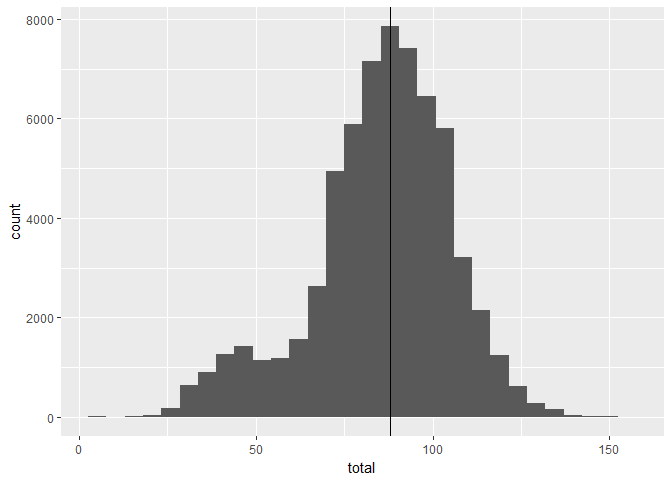
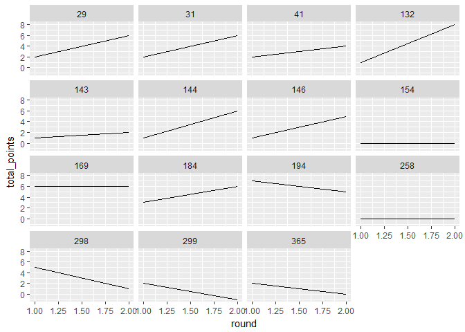
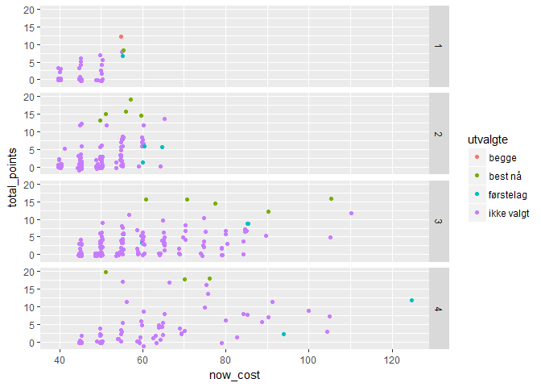
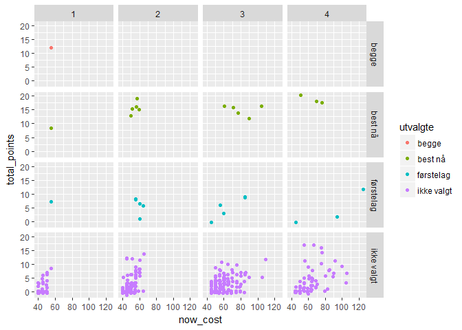

R Notebook
================

Mellom runde 2 og 3
-------------------

### Lagstatus

``` r
#spilleres lag fra totallista
#df_lag = datagrabber("lag")
summary(df_lag$total)
```

    ##    Min. 1st Qu.  Median    Mean 3rd Qu.    Max. 
    ##    3.00   76.00   88.00   85.48   98.00  153.00

``` r
kable(filter(df_lag,player_name=="Eivind Hageberg"))
```

|      id| entry\_name |  event\_total| player\_name    | movement | own\_entry |   rank|  last\_rank|  rank\_sort|  total|  entry|  league|  start\_event|  stop\_event| dato       |
|-------:|:------------|-------------:|:----------------|:---------|:-----------|------:|-----------:|-----------:|------:|------:|-------:|-------------:|------------:|:-----------|
|  194007| Moneyball   |            54| Eivind Hageberg | up       | FALSE      |  30723|       48416|       31253|     88|  36536|     319|             1|           30| 2017-04-07 |

``` r
#plotter poengtotal, med vline på min poengsum
qplot(total,data=df_lag)+
        geom_vline(xintercept = filter(df_lag,player_name=="Eivind Hageberg")$total)
```

    ## `stat_bin()` using `bins = 30`. Pick better value with `binwidth`.



Etter første runde lå jeg med 34 poeng et godt stykke ned. Med 54 poeng i andre runde klatra jeg opp til ca. midt i feltet.

``` r
kable(arrange(select(filter(df,first_team==1),id,navn,posisjon,team_navn,total_points,status,news,chance_of_playing_this_round,chance_of_playing_next_round,in_dreamteam),posisjon,desc(total_points)),caption="Første 15 spillere")
```

|   id| navn                     | posisjon | team\_navn |  total\_points| status | news                             |  chance\_of\_playing\_this\_round|  chance\_of\_playing\_next\_round| in\_dreamteam |
|----:|:-------------------------|:---------|:-----------|--------------:|:-------|:---------------------------------|---------------------------------:|---------------------------------:|:--------------|
|  169| André Hansen             | Keeper   | RBK        |             12| a      |                                  |                                NA|                                NA| TRUE          |
|  144| Sondre Rossbach          | Keeper   | ODD        |              7| a      |                                  |                                NA|                                NA| FALSE         |
|   29| Amin Nouri               | Forsvar  | BRA        |              8| a      |                                  |                                NA|                                NA| FALSE         |
|   31| Ruben Kristiansen        | Forsvar  | BRA        |              8| a      |                                  |                                NA|                                NA| FALSE         |
|  146| Espen Ruud               | Forsvar  | ODD        |              6| a      |                                  |                                NA|                                NA| FALSE         |
|  298| Jonathan Parr            | Forsvar  | SIF        |              6| a      |                                  |                                NA|                                NA| FALSE         |
|  299| Lars-Christopher Vilsvik | Forsvar  | SIF        |              1| a      |                                  |                                NA|                                NA| FALSE         |
|  132| Sander Svendsen          | Midtbane | MOL        |              9| a      |                                  |                                NA|                                NA| FALSE         |
|  184| Fredrik Midtsjø          | Midtbane | RBK        |              9| a      |                                  |                                NA|                                NA| FALSE         |
|   41| Sivert Heltne Nilsen     | Midtbane | BRA        |              6| a      |                                  |                                NA|                                NA| FALSE         |
|  143| Etzaz Hussain            | Midtbane | MOL        |              3| a      |                                  |                                NA|                                NA| FALSE         |
|  154| Ardian Gashi             | Midtbane | ODD        |              0| a      |                                  |                                NA|                                NA| FALSE         |
|  194| Nicklas Bendtner         | Angrep   | RBK        |             12| a      |                                  |                                NA|                                NA| FALSE         |
|  365| Mohammed Abdellaoue      | Angrep   | VIF        |              2| d      | Ukjent - 25% sjanse for å spille |                                NA|                                NA| FALSE         |
|  258| Fredrik Flo              | Angrep   | SOG        |              0| a      |                                  |                                NA|                                NA| FALSE         |

Her ser det ut til at noe har skjedd med Moa. Må passe på at han blir bytta ut med Flo. Flo fikk 0 poeng i de to første rundene - burde han heller byttes mot Kristiansen, for å gi en 5-4-1-formasjon? I utgangspunktet var jeg usikker, men så såg jeg at Flo ble autobytta av systemet - heldigvis. Gashi var også en av to spillere som ikke høsta poeng i første runde, og vi bytter han derfor ut med Heltne Nilsen - som i hvert fall skaffa to poeng.

Poengoversikten gir en kumulativ oversikt og noe om sist spilte kamp. Det er kan være nyttig å få informasjon om hver enkelt spilte kamp, slik at jeg lettere ser utviklinga over tid.

``` r
#df_spillerdata = datagrabber("spillere_poeng_kamp")
#test = full_join(df,df_spillerdata,by=c("id"="id_player"))

#I tillegg til det over: plotte poeng og pris for alle spillere og laget
#utfordring: plotte mine poeng (som inkl. kaptein og benk) eller poeng totalt?
#første omgang: poeng totalt
qplot(round,total_points,data=df_spillerdata[df_spillerdata$id_player %in% filter(df,first_team==1)$id,],facets=~id_player,geom="line")
```



Med to spillere som ikke produserer poeng og en skada er det på tide å gjøre noen bytter på spillermarkedet. I tillegg ser jeg at totalverdien på laget mitt er på veg nedover - i første omgang fra 100 millioner til 99.9 millioner, men allikevel.

### Lagforbedring

Det store spørsmålet er nå om og i så fall hvordan laget kan forbedres. Med 34 poeng og en plassering godt ned på [lista](https://github.com/gardenberg/fantasy_fotball/blob/master/modellevaluering.md), er det på en måte en trøst at selv topplasseringa med 97 poeng er noe unna maksimal mulig verdi på 145 poeng.

``` r
optimized_team = teamchooser(df) 
#returnerer ei liste med tre df: lp-objektet, df som passes og laget - bruk [[1]]
optimized_team[[1]]
```

    ## Success: the objective function is 228

``` r
df = optimized_team[[2]]
kable(select(optimized_team[[3]],id,navn,posisjon,team_navn,now_cost,selected_by_percent,total_points))
```

|   id| navn                  | posisjon | team\_navn |  now\_cost|  selected\_by\_percent|  total\_points|
|----:|:----------------------|:---------|:-----------|----------:|----------------------:|--------------:|
|  169| André Hansen          | Keeper   | RBK        |         55|                   32.0|             12|
|  116| Andreas Linde         | Keeper   | MOL        |         55|                    8.7|              8|
|  223| Sigurd Rosted         | Forsvar  | SO8        |         57|                   16.9|             19|
|  150| Thomas Grøgaard       | Forsvar  | ODD        |         56|                    8.1|             16|
|   33| Gilli Sørensen        | Forsvar  | BRA        |         60|                    8.4|             15|
|  127| Stian Gregersen       | Forsvar  | MOL        |         51|                    7.1|             15|
|  323| Simen Wangberg        | Forsvar  | TIL        |         50|                    9.8|             13|
|  107| Ifeanyi Matthew       | Midtbane | LSK        |         61|                   11.8|             16|
|  181| Mike Jensen           | Midtbane | RBK        |        105|                   28.3|             16|
|  228| Anders Trondsen       | Midtbane | SO8        |         71|                   13.6|             16|
|  187| Milan Jevtovic        | Midtbane | RBK        |         77|                   11.7|             14|
|   37| Fredrik Haugen        | Midtbane | BRA        |         90|                    8.4|             12|
|   65| Ibrahim Shuaibu       | Angrep   | FKH        |         51|                    6.5|             20|
|   64| Frederik Gytkjær      | Angrep   | FKH        |         76|                   15.6|             18|
|  278| Ohikhuaeme Omoijuanfo | Angrep   | STB        |         70|                   21.2|             18|

I utgangspunktet tenker jeg at det er for tidlig å kaste alt ut av vinduet. Med kun 1 kamp spilt for alle lagene, virker det vågalt å skulle prøve å bytte ut førstelaget mot dette laget - særlig tatt i betraktning av at en kun får ett bytte uten å motta fire minuspoeng.

En mulighet hadde vært å bytte ut en av spillerne i mitt lag mot en av spillerne fra det beste laget. Hvis det skulle vært spillere fra "optimal-laget" burde det vært en av følgende

``` r
qplot(now_cost,total_points,data=df,geom="jitter",color=utvalgte,facets=element_type~.)
```



``` r
qplot(now_cost,total_points,data=df,geom="jitter",color=utvalgte,facets=utvalgte~element_type+.)
```



``` r
#hvis målet er å holde seg innafor priskategorier trenger jeg ikke alle priskategorier, kun de på first_team.
test = filter(df,solution_full==1)
test = test[test$now_cost %in% levels(as.factor(df$now_cost[df$first_team==1])),]

#prøver å sette opp en interaksjon som også direkte gir spillerne disse over kan byttes mot
test_2 = filter(df,first_team==1) 
test_2 = test_2[interaction(test_2$now_cost,test_2$posisjon) %in% interaction(test$now_cost,test$posisjon),]

#lager en tabell og printer den
test_3 = bind_rows(select(test,id,navn,utvalgte,posisjon,team_navn,now_cost,selected_by_percent,status,total_points),select(test_2,id,navn,utvalgte,posisjon,team_navn,now_cost,selected_by_percent,status,total_points))

kable(arrange(test_3,posisjon,desc(total_points)))
```

|   id| navn                     | utvalgte  | posisjon | team\_navn |  now\_cost|  selected\_by\_percent| status |  total\_points|
|----:|:-------------------------|:----------|:---------|:-----------|----------:|----------------------:|:-------|--------------:|
|  169| André Hansen             | begge     | Keeper   | RBK        |         55|                   32.0| a      |             12|
|  169| André Hansen             | begge     | Keeper   | RBK        |         55|                   32.0| a      |             12|
|  116| Andreas Linde            | best nå   | Keeper   | MOL        |         55|                    8.7| a      |              8|
|  144| Sondre Rossbach          | førstelag | Keeper   | ODD        |         55|                   25.3| a      |              7|
|   33| Gilli Sørensen           | best nå   | Forsvar  | BRA        |         60|                    8.4| a      |             15|
|  298| Jonathan Parr            | førstelag | Forsvar  | SIF        |         60|                   18.9| a      |              6|
|  299| Lars-Christopher Vilsvik | førstelag | Forsvar  | SIF        |         60|                   22.9| a      |              1|

``` r
#hvis å velge et helt lag med div constraints er et lp-problem, bør det også la seg gjøre å formulere hva som vil være det beste byttet som et lp-problem? hvis det nye laget må ha 10 eller 9 spillere som var på first_team?

#tilleggsproblem i så fall: prisen på de nye spillerne må være lik pengene jeg har. men det er ikke noe problem, for totalverdi-constraintent gjelder fortsatt.

# et større tilleggsproblem: er tidligere performance en god indikator på future performance? bør ha litt utforsking og prediksjonsforsøk etter hvert.

optimized_team = teamchooser(df,incremental=TRUE)
#returnerer ei liste med tre df: lp-objektet, df som passes og laget - bruk [[1]]
optimized_team[[1]]
```

    ## Success: the objective function is 125

``` r
df = optimized_team[[2]]

#beste lag og første lag
kable(select(filter(df,((first_team==1&solution_incremental==1)|(first_team==1&solution_incremental==0)|(first_team==0&solution_incremental==1))),id,navn,posisjon,team_navn,now_cost,selected_by_percent,total_points,solution_incremental,first_team))
```

|   id| navn                     | posisjon | team\_navn |  now\_cost|  selected\_by\_percent|  total\_points|  solution\_incremental|  first\_team|
|----:|:-------------------------|:---------|:-----------|----------:|----------------------:|--------------:|----------------------:|------------:|
|   29| Amin Nouri               | Forsvar  | BRA        |         55|                    6.6|              8|                      1|            1|
|   31| Ruben Kristiansen        | Forsvar  | BRA        |         55|                    4.8|              8|                      1|            1|
|   41| Sivert Heltne Nilsen     | Midtbane | BRA        |         55|                    4.5|              6|                      1|            1|
|   65| Ibrahim Shuaibu          | Angrep   | FKH        |         51|                    6.5|             20|                      1|            0|
|  132| Sander Svendsen          | Midtbane | MOL        |         85|                   13.4|              9|                      1|            1|
|  143| Etzaz Hussain            | Midtbane | MOL        |         60|                   16.4|              3|                      1|            1|
|  144| Sondre Rossbach          | Keeper   | ODD        |         55|                   25.3|              7|                      1|            1|
|  146| Espen Ruud               | Forsvar  | ODD        |         65|                   37.6|              6|                      1|            1|
|  154| Ardian Gashi             | Midtbane | ODD        |         45|                    6.7|              0|                      1|            1|
|  169| André Hansen             | Keeper   | RBK        |         55|                   32.0|             12|                      1|            1|
|  184| Fredrik Midtsjø          | Midtbane | RBK        |         85|                   26.4|              9|                      1|            1|
|  194| Nicklas Bendtner         | Angrep   | RBK        |        125|                   48.9|             12|                      1|            1|
|  223| Sigurd Rosted            | Forsvar  | SO8        |         57|                   16.9|             19|                      1|            0|
|  258| Fredrik Flo              | Angrep   | SOG        |         45|                    4.0|              0|                      1|            1|
|  298| Jonathan Parr            | Forsvar  | SIF        |         60|                   18.9|              6|                      1|            1|
|  299| Lars-Christopher Vilsvik | Forsvar  | SIF        |         60|                   22.9|              1|                      0|            1|
|  365| Mohammed Abdellaoue      | Angrep   | VIF        |         94|                   14.9|              2|                      0|            1|

Algoritmen foreslår altså å selge Vilsvik og Abdellaoue, og kjøpe Rosted og Shuaibu. Det gjør jeg.

``` r
#i mange på¨en måte å hente ut laget mitt på lagrer jeg det hre

#bør først sette solution_incremental til now_team/sencond_team/team_2

#write.csv2(df,paste0("data/endra_lag_",Sys.Date(),".csv"),row.names=F)
```

En annen mulighet vil være å beholde deler av den opprinnelige modellen for å bedre predikere utviklinga til spillerne. Siden den modellen ikke gjorde det kjempeskarpt i første runde, tenker jeg at dette kan vente til jeg får inn mer data. Dessuten er jeg tom for tid til dette nå.
