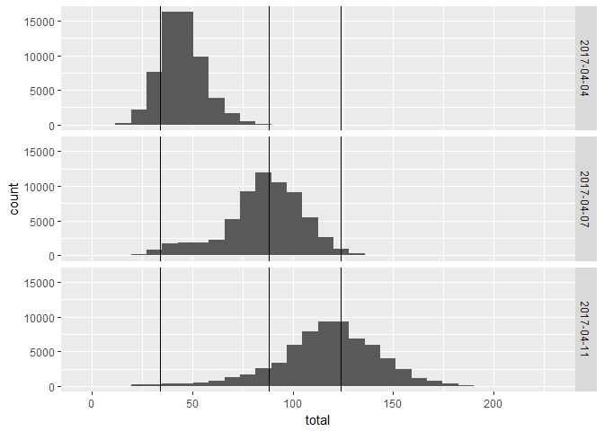

Lagutvikling mellom runde 3 og 4
================

Mellom runde 3 og 4
-------------------

### Lagstatus

``` r
#spilleres lag fra totallista
#df_lag = datagrabber("lag")
summary(df_lag$total)
```

    ##    Min. 1st Qu.  Median    Mean 3rd Qu.    Max. 
    ##    0.00   50.00   85.00   83.78  111.00  225.00

``` r
kable(filter(df_lag,player_name=="Eivind Hageberg"))
```

|      id| entry\_name |  event\_total| player\_name    | movement | own\_entry |   rank|  last\_rank|  rank\_sort|  total|  entry|  league|  start\_event|  stop\_event| dato       |
|-------:|:------------|-------------:|:----------------|:---------|:-----------|------:|-----------:|-----------:|------:|------:|-------:|-------------:|------------:|:-----------|
|  194007| Moneyball   |            34| Eivind Hageberg | new      | FALSE      |  48416|           0|       49429|     34|  36536|     319|             1|           30| 2017-04-04 |
|  194007| Moneyball   |            54| Eivind Hageberg | up       | FALSE      |  30723|       48416|       31253|     88|  36536|     319|             1|           30| 2017-04-07 |
|  194007| Moneyball   |            36| Eivind Hageberg | up       | FALSE      |  26879|       30723|       27107|    124|  36536|     319|             1|           30| 2017-04-11 |

``` r
#plotter poengtotal, med vline på min poengsum
qplot(total,data=df_lag,facets=dato~.)+
        geom_vline(xintercept = filter(df_lag,player_name=="Eivind Hageberg")$total)
```

    ## `stat_bin()` using `bins = 30`. Pick better value with `binwidth`.



Etter første runde lå jeg med 34 poeng et godt stykke ned. Med 54 poeng i andre runde klatra jeg opp til ca. midt i feltet. Med nye 36 poeng i tredje runde klatrer jeg enda litt til - slik at jeg nå er godt fornøyd.

### Spillertroppen

Hvordan står det til med spillertroppen?

``` r
kable(arrange(select(filter(df,team_now==1),id,navn,posisjon,team_navn,total_points,status,news,chance_of_playing_this_round,chance_of_playing_next_round,in_dreamteam),posisjon,desc(total_points)),caption="Nåværende 15 spillere")
```

|   id| navn                 | posisjon | team\_navn |  total\_points| status | news |  chance\_of\_playing\_this\_round|  chance\_of\_playing\_next\_round| in\_dreamteam |
|----:|:---------------------|:---------|:-----------|--------------:|:-------|:-----|---------------------------------:|---------------------------------:|:--------------|
|   65| Ibrahim Shuaibu      | Angrep   | FKH        |             26| a      |      |                                NA|                                NA| TRUE          |
|  194| Nicklas Bendtner     | Angrep   | RBK        |             12| a      |      |                                NA|                                NA| FALSE         |
|  258| Fredrik Flo          | Angrep   | SOG        |              0| a      |      |                                NA|                                NA| FALSE         |
|  223| Sigurd Rosted        | Forsvar  | SO8        |             25| a      |      |                                NA|                                NA| TRUE          |
|   29| Amin Nouri           | Forsvar  | BRA        |             10| a      |      |                                NA|                                NA| FALSE         |
|   31| Ruben Kristiansen    | Forsvar  | BRA        |             10| a      |      |                                NA|                                NA| FALSE         |
|  298| Jonathan Parr        | Forsvar  | SIF        |              8| a      |      |                                NA|                                NA| FALSE         |
|  146| Espen Ruud           | Forsvar  | ODD        |              7| a      |      |                                NA|                                NA| FALSE         |
|  169| André Hansen         | Keeper   | RBK        |             14| a      |      |                                NA|                                NA| FALSE         |
|  144| Sondre Rossbach      | Keeper   | ODD        |              9| a      |      |                                NA|                                NA| FALSE         |
|  184| Fredrik Midtsjø      | Midtbane | RBK        |             19| a      |      |                                NA|                                NA| FALSE         |
|  132| Sander Svendsen      | Midtbane | MOL        |             11| a      |      |                                NA|                                NA| FALSE         |
|   41| Sivert Heltne Nilsen | Midtbane | BRA        |              7| a      |      |                                NA|                                NA| FALSE         |
|  143| Etzaz Hussain        | Midtbane | MOL        |              3| a      |      |                                NA|                                NA| FALSE         |
|  154| Ardian Gashi         | Midtbane | ODD        |              0| a      |      |                                NA|                                NA| FALSE         |

Ingen av spillerne er flagget med skader eller lignende, ingen har plutselig endt opp i utlandet. Alt i alt greit - men vi ser at det er store forskjeller i hvor mange poeng de har sanket inn.

Poengoversikten i tabellen gir en kumulativ oversikt og noe om sist spilte kamp. Det er kan være nyttig å få informasjon om hver enkelt spilte kamp, slik at jeg lettere ser utviklinga over tid.

Med to spillere som ikke produserer poeng bør jeg gjøre noen bytter på spillermarkedet. I tillegg ser jeg at totalverdien på laget mitt er på veg nedover - i første omgang har det bare sunket fra 100 millioner til 99.7 millioner, men det kan allikevel tyde på at det er noe som skjer som jeg ikke fanger opp her.

### Lagforbedring

Drømmelaget (lineært optimalisert) hadde bestått av følgende femten spillere (NB - det er jo ikke slik at de 15 hadde gitt det poengbeløpet algoritmen finner - det er jo kun mulig for 11 spillere å spille på en gang)

``` r
optimized_team = teamchooser(df) 
#returnerer ei liste med tre df: lp-objektet, df som passes og laget - bruk [[1]]
optimized_team[[1]]
```

    ## Success: the objective function is 327

``` r
df = optimized_team[[2]]
kable(select(optimized_team[[3]],id,navn,posisjon,team_navn,now_cost,selected_by_percent,total_points))
```

|   id| navn              | posisjon | team\_navn |  now\_cost|  selected\_by\_percent|  total\_points|
|----:|:------------------|:---------|:-----------|----------:|----------------------:|--------------:|
|    1| Andreas Lie       | Keeper   | AAFK       |         45|                    6.3|             16|
|  321| Gudmund Kongshavn | Keeper   | TIL        |         45|                    3.7|             13|
|  323| Simen Wangberg    | Forsvar  | TIL        |         51|                   13.0|             28|
|  223| Sigurd Rosted     | Forsvar  | SO8        |         57|                   20.8|             25|
|  193| Vegar Hedenstad   | Forsvar  | RBK        |         65|                   16.8|             19|
|   33| Gilli Sørensen    | Forsvar  | BRA        |         61|                   10.1|             18|
|  127| Stian Gregersen   | Forsvar  | MOL        |         51|                   10.6|             18|
|  228| Anders Trondsen   | Midtbane | SO8        |         72|                   21.7|             30|
|  187| Milan Jevtovic    | Midtbane | RBK        |         78|                   18.3|             26|
|  107| Ifeanyi Matthew   | Midtbane | LSK        |         62|                   16.2|             20|
|  334| Gjermund Åsen     | Midtbane | TIL        |         59|                    3.4|             20|
|  184| Fredrik Midtsjø   | Midtbane | RBK        |         85|                   26.8|             19|
|  233| Patrick Mortensen | Angrep   | SO8        |         67|                   13.3|             27|
|   65| Ibrahim Shuaibu   | Angrep   | FKH        |         51|                   10.5|             26|
|  319| Marco Tagbajumi   | Angrep   | SIF        |         76|                   11.5|             22|

Går laget mitt så dårlig at jeg bør bruke en av jokerne som gjør det mulig å bytte hele troppen? Nei, ikke egentlig, ikke enda - så det holder vi oss unna, foreløpig.

En bedre mulighet er å bytte ut en av spillerne i mitt lag mot en av spillerne fra det beste laget. Hvis det skulle vært spillere fra "optimal-laget" burde det vært en av følgende:

``` r
#hvis å velge et helt lag med div constraints er et lp-problem, bør det også la seg gjøre å formulere hva som vil være det beste byttet som et lp-problem? hvis det nye laget må ha 10 eller 9 spillere som var på first_team?

#tilleggsproblem i så fall: prisen på de nye spillerne må være lik pengene jeg har. men det er ikke noe problem, for totalverdi-constraintent gjelder fortsatt.

# et større tilleggsproblem: er tidligere performance en god indikator på future performance? bør ha litt utforsking og prediksjonsforsøk etter hvert.

optimized_team = teamchooser(df,incremental=TRUE)
#returnerer ei liste med tre df: lp-objektet, df som passes og laget - bruk [[1]]
optimized_team[[1]]
```

    ## Success: the objective function is 191

``` r
df = optimized_team[[2]]

#beste lag og laget nå
kable(arrange(select(filter(df,((team_now==1&solution_incremental==1)|(team_now==1&solution_incremental==0)|(team_now==0&solution_incremental==1))),id,navn,posisjon,team_navn,now_cost,selected_by_percent,total_points,solution_incremental,team_now),posisjon))
```

|   id| navn                 | posisjon | team\_navn |  now\_cost|  selected\_by\_percent|  total\_points|  solution\_incremental|  team\_now|
|----:|:---------------------|:---------|:-----------|----------:|----------------------:|--------------:|----------------------:|----------:|
|   65| Ibrahim Shuaibu      | Angrep   | FKH        |         51|                   10.5|             26|                      1|          1|
|  194| Nicklas Bendtner     | Angrep   | RBK        |        125|                   49.1|             12|                      1|          1|
|  258| Fredrik Flo          | Angrep   | SOG        |         44|                    3.7|              0|                      1|          1|
|   29| Amin Nouri           | Forsvar  | BRA        |         55|                    6.7|             10|                      1|          1|
|   31| Ruben Kristiansen    | Forsvar  | BRA        |         55|                    4.8|             10|                      1|          1|
|  146| Espen Ruud           | Forsvar  | ODD        |         65|                   37.0|              7|                      1|          1|
|  223| Sigurd Rosted        | Forsvar  | SO8        |         57|                   20.8|             25|                      1|          1|
|  298| Jonathan Parr        | Forsvar  | SIF        |         60|                   18.3|              8|                      1|          1|
|  144| Sondre Rossbach      | Keeper   | ODD        |         55|                   25.3|              9|                      1|          1|
|  169| André Hansen         | Keeper   | RBK        |         55|                   32.2|             14|                      1|          1|
|   41| Sivert Heltne Nilsen | Midtbane | BRA        |         55|                    4.6|              7|                      1|          1|
|  132| Sander Svendsen      | Midtbane | MOL        |         85|                   13.5|             11|                      1|          1|
|  143| Etzaz Hussain        | Midtbane | MOL        |         59|                   14.1|              3|                      1|          1|
|  154| Ardian Gashi         | Midtbane | ODD        |         45|                    6.2|              0|                      0|          1|
|  184| Fredrik Midtsjø      | Midtbane | RBK        |         85|                   26.8|             19|                      1|          1|
|  228| Anders Trondsen      | Midtbane | SO8        |         72|                   21.7|             30|                      1|          0|

Algoritmen foreslår altså å selge Gashi og kjøpe Trondsen.

En annen mulighet vil være å beholde deler av den opprinnelige modellen for å bedre predikere utviklinga til spillerne. Siden den modellen ikke gjorde det kjempeskarpt i første runde, tenker jeg at dette kan vente til jeg får inn mer data. Dessuten er jeg tom for tid til dette nå.
