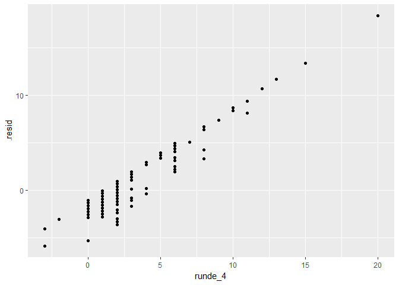
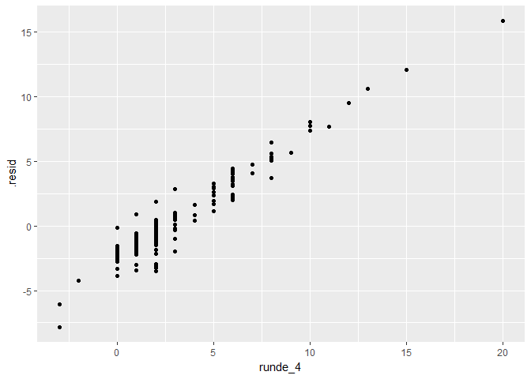

Lagutvikling og prediksjonsforsøk før runde 5
================

### Lagstatus

``` r
#plotter poengtotal, med vline på min poengsum
qplot(total,data=df_lag,facets=dato~.)+
        geom_vline(xintercept = filter(df_lag,player_name=="Eivind Hageberg")$total,facets=dato~.)
```

    ## Warning: Ignoring unknown parameters: facets

    ## `stat_bin()` using `bins = 30`. Pick better value with `binwidth`.


Det har gått oppover, men fjerde runde ga et ørlite fall (etter Rosteds utvisning).

### Spillertroppen

``` r
kable(arrange(select(filter(df,team_now==1),id,navn,posisjon,team_navn,total_points,status,news,chance_of_playing_this_round,chance_of_playing_next_round,in_dreamteam),posisjon,desc(total_points)),caption="Nåværende 15 spillere")
```

|   id| navn                 | posisjon | team\_navn |  total\_points| status | news      |  chance\_of\_playing\_this\_round|  chance\_of\_playing\_next\_round| in\_dreamteam |
|----:|:---------------------|:---------|:-----------|--------------:|:-------|:----------|---------------------------------:|---------------------------------:|:--------------|
|  169| André Hansen         | Keeper   | RBK        |             25| a      |           |                                NA|                                NA| TRUE          |
|  144| Sondre Rossbach      | Keeper   | ODD        |             19| a      |           |                                NA|                                NA| FALSE         |
|  223| Sigurd Rosted        | Forsvar  | SO8        |             22| s      | Rødt kort |                                NA|                                NA| FALSE         |
|  146| Espen Ruud           | Forsvar  | ODD        |             13| a      |           |                                NA|                                NA| FALSE         |
|   29| Amin Nouri           | Forsvar  | BRA        |             12| a      |           |                                NA|                                NA| FALSE         |
|   31| Ruben Kristiansen    | Forsvar  | BRA        |             12| a      |           |                                NA|                                NA| FALSE         |
|  298| Jonathan Parr        | Forsvar  | SIF        |             10| a      |           |                                NA|                                NA| FALSE         |
|  228| Anders Trondsen      | Midtbane | SO8        |             32| a      |           |                                NA|                                NA| TRUE          |
|  132| Sander Svendsen      | Midtbane | MOL        |             26| a      |           |                                NA|                                NA| TRUE          |
|  184| Fredrik Midtsjø      | Midtbane | RBK        |             22| a      |           |                                NA|                                NA| FALSE         |
|   41| Sivert Heltne Nilsen | Midtbane | BRA        |             15| a      |           |                                NA|                                NA| FALSE         |
|  143| Etzaz Hussain        | Midtbane | MOL        |              4| a      |           |                                NA|                                NA| FALSE         |
|   65| Ibrahim Shuaibu      | Angrep   | FKH        |             28| a      |           |                                NA|                                NA| FALSE         |
|  194| Nicklas Bendtner     | Angrep   | RBK        |             13| a      |           |                                NA|                                NA| FALSE         |
|  258| Fredrik Flo          | Angrep   | SOG        |              0| a      |           |                                NA|                                NA| FALSE         |

Rosted har fått rødt kort.

Etter forrige ukes bytte, har verdien på laget mitt heldigvis gått i riktig retning igjen.

### Lagforbedring

### Modell 1: kan vi forutsi framtidige poeng med fortidens poeng?

I likhet med tidligere kan vi ta en rask kikk på drømmelaget (som funnet ved lineær optimalisering). Det hadde bestått av følgende femten spillere:

``` r
optimized_team = teamchooser(df) 
#returnerer ei liste med tre df: lp-objektet, df som passes og laget - bruk [[1]]
optimized_team[[1]]
```

    ## Success: the objective function is 395

``` r
df = optimized_team[[2]]
kable(select(optimized_team[[3]],id,navn,posisjon,team_navn,now_cost,selected_by_percent,total_points))
```

|   id| navn                  | posisjon | team\_navn |  now\_cost|  selected\_by\_percent|  total\_points|
|----:|:----------------------|:---------|:-----------|----------:|----------------------:|--------------:|
|  169| André Hansen          | Keeper   | RBK        |         55|                   32.9|             25|
|    1| Andreas Lie           | Keeper   | AAFK       |         45|                    8.4|             20|
|  323| Simen Wangberg        | Forsvar  | TIL        |         52|                   19.5|             30|
|  193| Vegar Hedenstad       | Forsvar  | RBK        |         66|                   18.7|             25|
|  127| Stian Gregersen       | Forsvar  | MOL        |         53|                   16.5|             24|
|  150| Thomas Grøgaard       | Forsvar  | ODD        |         57|                   12.2|             23|
|  223| Sigurd Rosted         | Forsvar  | SO8        |         58|                   20.5|             22|
|  228| Anders Trondsen       | Midtbane | SO8        |         74|                   32.6|             32|
|  187| Milan Jevtovic        | Midtbane | RBK        |         80|                   25.1|             29|
|  132| Sander Svendsen       | Midtbane | MOL        |         86|                   20.4|             26|
|  107| Ifeanyi Matthew       | Midtbane | LSK        |         62|                   19.0|             22|
|  206| Håvard Storbaek       | Midtbane | SAN        |         55|                    2.9|             22|
|  278| Ohikhuaeme Omoijuanfo | Angrep   | STB        |         72|                   29.6|             37|
|  212| Flamur Kastrati       | Angrep   | SAN        |         61|                    5.9|             29|
|  233| Patrick Mortensen     | Angrep   | SO8        |         69|                   19.6|             29|

``` r
optimized_team = teamchooser(df,incremental=TRUE,max_team_cost=1001)
#returnerer ei liste med tre df: lp-objektet, df som passes og laget - bruk [[1]]
optimized_team[[1]]
```

    ## Success: the objective function is 282

``` r
df = optimized_team[[2]]

#beste lag og laget nå
kable(arrange(select(filter(df,((team_now==1&solution_incremental==1)|(team_now==1&solution_incremental==0)|(team_now==0&solution_incremental==1))),id,navn,posisjon,team_navn,now_cost,selected_by_percent,total_points,solution_incremental,team_now),posisjon))
```

|   id| navn                 | posisjon | team\_navn |  now\_cost|  selected\_by\_percent|  total\_points|  solution\_incremental|  team\_now|
|----:|:---------------------|:---------|:-----------|----------:|----------------------:|--------------:|----------------------:|----------:|
|  144| Sondre Rossbach      | Keeper   | ODD        |         55|                   25.6|             19|                      1|          1|
|  169| André Hansen         | Keeper   | RBK        |         55|                   32.9|             25|                      1|          1|
|   29| Amin Nouri           | Forsvar  | BRA        |         55|                    6.7|             12|                      1|          1|
|   31| Ruben Kristiansen    | Forsvar  | BRA        |         55|                    4.9|             12|                      1|          1|
|  146| Espen Ruud           | Forsvar  | ODD        |         65|                   36.3|             13|                      1|          1|
|  223| Sigurd Rosted        | Forsvar  | SO8        |         58|                   20.5|             22|                      1|          1|
|  298| Jonathan Parr        | Forsvar  | SIF        |         60|                   17.5|             10|                      1|          1|
|   41| Sivert Heltne Nilsen | Midtbane | BRA        |         55|                    4.7|             15|                      1|          1|
|  132| Sander Svendsen      | Midtbane | MOL        |         86|                   20.4|             26|                      1|          1|
|  143| Etzaz Hussain        | Midtbane | MOL        |         58|                   11.2|              4|                      1|          1|
|  184| Fredrik Midtsjø      | Midtbane | RBK        |         85|                   27.3|             22|                      1|          1|
|  228| Anders Trondsen      | Midtbane | SO8        |         74|                   32.6|             32|                      1|          1|
|   65| Ibrahim Shuaibu      | Angrep   | FKH        |         52|                   12.3|             28|                      1|          1|
|  194| Nicklas Bendtner     | Angrep   | RBK        |        125|                   46.8|             13|                      1|          1|
|  212| Flamur Kastrati      | Angrep   | SAN        |         61|                    5.9|             29|                      1|          0|
|  258| Fredrik Flo          | Angrep   | SOG        |         44|                    3.2|              0|                      0|          1|

Det ene spillerbyttet som gir størst økning er FLo mot Kastrati. Å bytte Gashi mot Trondsen ser ut til å ha vært et godt bytte (foreløpig).

Denne gangen vil jeg imidlertid se nærmere på (en variant av) den underliggende antakelsen bak modellen over: at tidligere tildelte poeng er en god måte å forutsi framtidige poeng på. Dette er en variant, fordi den lineære optimeringsmodellen over ser på totalt kumulerte poeng, mens under ser jeg på framtidige nye poeng.

En grunn er at framtidig totalt kumulerte poeng = nye poeng + totalt kumulerte poeng, slik at det som blir analysert som avhengig variabel i praksis blir de nye poengene. En annen grunn (som gjelder hvis det er en substansiell forskjell her) er at jeg ser etter spillere som vil kunne skaffe laget mitt mange poeng i framtida - ikke spillere som har skaffet laget sitt mange poeng i fortida.

``` r
#trekker ut poengene i en egen df og gjør noen beregninger for å gjøre lm mulig/lettere
df_poeng = spread(select(df_spillerdata,id_player,round,total_points),round,total_points)
names(df_poeng)[2:5]=paste0("runde_",names(df_poeng)[2:5])
df_poeng$runde_1_3 = df_poeng$runde_1+df_poeng$runde_2+df_poeng$runde_3
df_poeng$runde_1_2 = df_poeng$runde_1+df_poeng$runde_2
df_poeng$runde_3_4 = df_poeng$runde_3+df_poeng$runde_4

#modeller med eget term for poeng
df_poeng$runde_1_poeng = 0
df_poeng$runde_1_poeng[df_poeng$runde_1!=0] = 1
df_poeng$runde_2_poeng = 0
df_poeng$runde_2_poeng[df_poeng$runde_2!=0] = 1        
df_poeng$runde_3_poeng = 0
df_poeng$runde_3_poeng[df_poeng$runde_3!=0] = 1
df_poeng$runde_4_poeng = 0
df_poeng$runde_4_poeng[df_poeng$runde_4!=0] = 1
df_poeng$runde_1_2_poeng = 0
df_poeng$runde_1_2_poeng[df_poeng$runde_1_2!=0] = 1
df_poeng$runde_3_4_poeng = 0
df_poeng$runde_3_4_poeng[df_poeng$runde_3_4!=0] = 1
df_poeng$runde_1_3_poeng = 0
df_poeng$runde_1_3_poeng[df_poeng$runde_1_3!=0] = 1
```

``` r
#grafisk fordelingsanalyse
qplot(as.factor(round),total_points,data=df_spillerdata,geom="boxplot")
```


``` r
summary(df_poeng$runde_1_3)
```

    ##    Min. 1st Qu.  Median    Mean 3rd Qu.    Max.    NA's 
    ##   0.000   0.000   2.500   4.402   7.000  30.000       2

``` r
qplot(runde_1,data=df_poeng,binwidth=1)
```

    ## Warning: Removed 2 rows containing non-finite values (stat_bin).


``` r
qplot(runde_2,data=df_poeng,binwidth=1)
```


``` r
qplot(runde_3,data=df_poeng,binwidth=1)
```


``` r
qplot(runde_4,data=df_poeng,binwidth=1)
```


``` r
qplot(runde_1_2,data=df_poeng,binwidth=1)
```

    ## Warning: Removed 2 rows containing non-finite values (stat_bin).


``` r
qplot(runde_3_4,data=df_poeng,binwidth=1)
```


``` r
qplot(runde_1_3,data=df_poeng,binwidth=1)
```

    ## Warning: Removed 2 rows containing non-finite values (stat_bin).

 Alle fordelingene er høyreskjeve - de fleste spillerne har null poeng eller deromkring, og få spillere har høyere verdier. Det gjelder også når vi summerer over runder - den første kvartilen (25 % av spillerne) har 0 poeng. I boksplot-sammenheng er alle verdier over fem poeng å betrakte som uteliggere.

Som [Hyndman](https://stats.stackexchange.com/questions/1444/how-should-i-transform-non-negative-data-including-zeros) kommenterer i et spørsmål på CrossValidated er en vanlig tilnærming å logtransformere med log(x+1), mens den generelle tilnærminga med Box-Cox-transformasjon kanskje er å foretrekke. En annen variant er å legge inn et ledd for poeng/ikke-poeng (anbefalt av Whuber på [CrossValidated](https://stats.stackexchange.com/questions/6563/80-of-missing-data-in-a-single-variable)).

``` r
#logtransformering
#boxcox-transformering kan også være riktig/en mer generell tilnærming
qplot(log(runde_1+1),data=df_poeng)
```

    ## `stat_bin()` using `bins = 30`. Pick better value with `binwidth`.

    ## Warning: Removed 5 rows containing non-finite values (stat_bin).


``` r
qplot(log(runde_1_3+1),data=df_poeng)
```

    ## `stat_bin()` using `bins = 30`. Pick better value with `binwidth`.

    ## Warning: Removed 2 rows containing non-finite values (stat_bin).


``` r
#enkle diagram for sammenheng

skala = c(min(select(df_poeng,-id_player),na.rm=T),max(select(df_poeng,-id_player),na.rm=T))
qplot(runde_1,runde_2,data=df_poeng)+
        scale_y_continuous(limits=skala)+
        scale_x_continuous(limits=skala)+
        ggtitle("Poeng i runde 2 som funksjon av poeng i runde 1")
```

    ## Warning: Removed 2 rows containing missing values (geom_point).


``` r
qplot(runde_2,runde_3,data=df_poeng)+
        scale_y_continuous(limits=skala)+
        scale_x_continuous(limits=skala)+
        ggtitle("Poeng i runde 3 som funksjon av poeng i runde 2")
```


``` r
qplot(runde_3,runde_4,data=df_poeng)+
        scale_y_continuous(limits=skala)+
        scale_x_continuous(limits=skala)+
        ggtitle("Poeng i runde 4 som funksjon av poeng i runde 3")
```


Scatterplottene tyder på at det ikke er en sterk positiv lineær sammenheng, kanskje heller en kubisk sammenheng. Kombinert med at det er langt flere observasjoner med 0 og andre lave poengsum, er jeg skeptisk til om en lineær modell kan gi gode prediksjoner på framtidig poengsum. Estimerer derfor en rekke modeller under, og sammenlikner presisjon med MAE - mean average error - og goodness-of-fitt, R2.

``` r
#dette kan gjøres bedre: kanskje lage en funksjon som kalles en eller flere ganger, augment-informasjon kan legges til en felles df, plots kan stables penere (hvis mulig i knitta github_document)

#estimerer en lineær modell av poeng_t+1~poeng_t

#r2~r1
lmmodell_1 = lm(runde_2~runde_1,data=df_poeng)
tidy(lmmodell_1)
```

    ##          term  estimate  std.error statistic      p.value
    ## 1 (Intercept) 0.9494420 0.13633434  6.964071 1.251622e-11
    ## 2     runde_1 0.3540487 0.04943098  7.162485 3.482551e-12

``` r
df_lmmodell_1 = augment(lmmodell_1)
df_lmmodell_1$.mae = df_lmmodell_1$runde_2 - df_lmmodell_1$.fitted
#sammenhengplot
qplot(runde_1,runde_2,data=df_poeng)+
        geom_abline(intercept = 0.9494420,slope=0.3540487)
```

    ## Warning: Removed 2 rows containing missing values (geom_point).


``` r
#diagnoseplots
qplot(runde_2,.fitted,data=df_lmmodell_1)
```


``` r
qplot(runde_2,.resid,data=df_lmmodell_1)
```


``` r
df_modell = data.frame("modellnavn"="lmmodell_1","mean abs error"=mean(abs(df_lmmodell_1$.mae),na.rm=T),glance(lmmodell_1))

#r3~r2
lmmodell_2 = lm(runde_3~runde_2,data=df_poeng)
tidy(lmmodell_2)
```

    ##          term  estimate  std.error statistic      p.value
    ## 1 (Intercept) 1.0591727 0.13482084  7.856149 3.201903e-14
    ## 2     runde_2 0.3106029 0.04599334  6.753215 4.705600e-11

``` r
df_lmmodell_2 = augment(lmmodell_2)
df_lmmodell_2$.mae = df_lmmodell_2$runde_3 - df_lmmodell_2$.fitted
qplot(runde_2,runde_3,data=df_poeng)+
        geom_abline(intercept = tidy(lmmodell_2)[1,2],slope=tidy(lmmodell_2)[2,2])
```


``` r
qplot(runde_3,.fitted,data=df_lmmodell_2)
```


``` r
qplot(runde_3,.resid,data=df_lmmodell_2)
```


``` r
df_modell = bind_rows(df_modell,data.frame("modellnavn"="lmmodell_2","mean abs error"=mean(abs(df_lmmodell_2$.mae),na.rm=T),glance(lmmodell_2)))
```

    ## Warning in bind_rows_(x, .id): Unequal factor levels: coercing to character

``` r
#r4~r3
lmmodell_3 = lm(runde_4~runde_3,data=df_poeng)
tidy(lmmodell_3)
```

    ##          term  estimate  std.error statistic      p.value
    ## 1 (Intercept) 1.0369276 0.13694431  7.571893 2.267162e-13
    ## 2     runde_3 0.3052872 0.04613723  6.616940 1.093134e-10

``` r
df_lmmodell_3 = augment(lmmodell_3)
df_lmmodell_3$.mae = df_lmmodell_3$runde_4 - df_lmmodell_3$.fitted
qplot(runde_3,runde_4,data=df_poeng)+
        geom_abline(intercept = tidy(lmmodell_3)[1,2],slope=tidy(lmmodell_3)[2,2])
```


``` r
qplot(runde_4,.fitted,data=df_lmmodell_3)
```


``` r
qplot(runde_4,.resid,data=df_lmmodell_3)
```



``` r
df_modell = bind_rows(df_modell,data.frame("modellnavn"="lmmodell_3","mean abs error"=mean(abs(df_lmmodell_3$.mae),na.rm=T),glance(lmmodell_3)))

#r4~r1_3
lmmodell_4 = lm(runde_4~runde_1_3,data=df_poeng)
tidy(lmmodell_4)
```

    ##          term  estimate std.error statistic      p.value
    ## 1 (Intercept) 0.5840564 0.1409624  4.143348 4.126307e-05
    ## 2   runde_1_3 0.2091156 0.0198243 10.548446 2.801268e-23

``` r
summary(lmmodell_4)
```

    ## 
    ## Call:
    ## lm(formula = runde_4 ~ runde_1_3, data = df_poeng)
    ## 
    ## Residuals:
    ##     Min      1Q  Median      3Q     Max 
    ## -8.8119 -0.7932 -0.5841  0.1613 15.2336 
    ## 
    ## Coefficients:
    ##             Estimate Std. Error t value Pr(>|t|)    
    ## (Intercept)  0.58406    0.14096   4.143 4.13e-05 ***
    ## runde_1_3    0.20912    0.01982  10.548  < 2e-16 ***
    ## ---
    ## Signif. codes:  0 '***' 0.001 '**' 0.01 '*' 0.05 '.' 0.1 ' ' 1
    ## 
    ## Residual standard error: 2.295 on 428 degrees of freedom
    ##   (2 observations deleted due to missingness)
    ## Multiple R-squared:  0.2063, Adjusted R-squared:  0.2045 
    ## F-statistic: 111.3 on 1 and 428 DF,  p-value: < 2.2e-16

``` r
df_lmmodell_4 = augment(lmmodell_4)
df_lmmodell_4$.mae = df_lmmodell_4$runde_4 - df_lmmodell_4$.fitted
qplot(runde_4,.fitted,data=df_lmmodell_4)
```


``` r
qplot(runde_4,.resid,data=df_lmmodell_4)
```


``` r
df_modell = bind_rows(df_modell,data.frame("modellnavn"="lmmodell_4","mean abs error"=mean(abs(df_lmmodell_4$.mae),na.rm=T),glance(lmmodell_4)))

#r3_4~r1_2
lmmodell_5 = lm(runde_3_4~runde_1_2,data=df_poeng)
tidy(lmmodell_5)
```

    ##          term  estimate  std.error statistic      p.value
    ## 1 (Intercept) 1.4285553 0.20877146  6.842675 2.701124e-11
    ## 2   runde_1_2 0.5517496 0.04231499 13.039104 5.870093e-33

``` r
summary(lmmodell_5)
```

    ## 
    ## Call:
    ## lm(formula = runde_3_4 ~ runde_1_2, data = df_poeng)
    ## 
    ## Residuals:
    ##      Min       1Q   Median       3Q      Max 
    ## -11.0496  -1.4286  -1.4286   0.7524  14.4679 
    ## 
    ## Coefficients:
    ##             Estimate Std. Error t value Pr(>|t|)    
    ## (Intercept)  1.42856    0.20877   6.843  2.7e-11 ***
    ## runde_1_2    0.55175    0.04231  13.039  < 2e-16 ***
    ## ---
    ## Signif. codes:  0 '***' 0.001 '**' 0.01 '*' 0.05 '.' 0.1 ' ' 1
    ## 
    ## Residual standard error: 3.511 on 428 degrees of freedom
    ##   (2 observations deleted due to missingness)
    ## Multiple R-squared:  0.2843, Adjusted R-squared:  0.2826 
    ## F-statistic:   170 on 1 and 428 DF,  p-value: < 2.2e-16

``` r
df_lmmodell_5 = augment(lmmodell_5)
df_lmmodell_5$.mae = df_lmmodell_5$runde_3_4 - df_lmmodell_5$.fitted
qplot(runde_1_2,runde_3_4,data=df_poeng)+
        geom_abline(intercept = tidy(lmmodell_5)[1,2],slope=tidy(lmmodell_5)[2,2])
```

    ## Warning: Removed 2 rows containing missing values (geom_point).


``` r
qplot(runde_3_4,.fitted,data=df_lmmodell_5)
```


``` r
qplot(runde_3_4,.resid,data=df_lmmodell_5)
```


``` r
df_modell = bind_rows(df_modell,data.frame("modellnavn"="lmmodell_5","mean abs error"=mean(abs(df_lmmodell_5$.mae),na.rm=T),glance(lmmodell_5)))
```

``` r
#modeller med log
#log(r4)~log(r1_3)
lmmodell_6 = lm(log(runde_4+1)~log(runde_1_3+1),data=df_poeng)
```

    ## Warning in log(runde_4 + 1): NaNs produced

``` r
tidy(lmmodell_6)
```

    ##                 term   estimate  std.error statistic      p.value
    ## 1        (Intercept) 0.07419561 0.03840058  1.932148 5.400554e-02
    ## 2 log(runde_1_3 + 1) 0.46920711 0.02465255 19.032799 7.309113e-59

``` r
summary(lmmodell_6)
```

    ## 
    ## Call:
    ## lm(formula = log(runde_4 + 1) ~ log(runde_1_3 + 1), data = df_poeng)
    ## 
    ## Residuals:
    ##     Min      1Q  Median      3Q     Max 
    ## -1.4558 -0.1415 -0.0742  0.1649  1.7978 
    ## 
    ## Coefficients:
    ##                    Estimate Std. Error t value Pr(>|t|)    
    ## (Intercept)         0.07420    0.03840   1.932    0.054 .  
    ## log(runde_1_3 + 1)  0.46921    0.02465  19.033   <2e-16 ***
    ## ---
    ## Signif. codes:  0 '***' 0.001 '**' 0.01 '*' 0.05 '.' 0.1 ' ' 1
    ## 
    ## Residual standard error: 0.5387 on 425 degrees of freedom
    ##   (5 observations deleted due to missingness)
    ## Multiple R-squared:  0.4601, Adjusted R-squared:  0.4589 
    ## F-statistic: 362.2 on 1 and 425 DF,  p-value: < 2.2e-16

``` r
df_lmmodell_6 = augment(lmmodell_6)
df_lmmodell_6$.mae = df_lmmodell_6$log.runde_4...1. - df_lmmodell_6$.fitted
#ville egentlig beregne gjennomsnittlig %-feil, men det lar seg vanskelig gjør emed så mange nuller som det er her - blir bare inf.
qplot(log.runde_4...1.,.fitted,data=df_lmmodell_6)
```


``` r
qplot(log.runde_4...1.,.resid,data=df_lmmodell_6)
```


``` r
df_modell = bind_rows(df_modell,data.frame("modellnavn"="lmmodell_6","mean abs error"=mean(abs(df_lmmodell_6$.mae),na.rm=T),glance(lmmodell_6)))

#interessant funksjon fra forcast-pakka
#https://www.otexts.org/fpp/2/5
accuracy(df_lmmodell_6$.fitted,df_lmmodell_6$log.runde_4...1.)
```

    ##                    ME      RMSE       MAE  MPE MAPE
    ## Test set 5.009833e-17 0.5374319 0.3682714 -Inf  Inf

``` r
#modeller med term for poeng eller ikke
#r4~r1_3+poeng
lmmodell_7 = lm(runde_4~runde_1_3+runde_1_3_poeng,data=df_poeng)
tidy(lmmodell_7)
```

    ##              term  estimate  std.error statistic      p.value
    ## 1     (Intercept) 0.1176471 0.17218632 0.6832544 4.948167e-01
    ## 2       runde_1_3 0.1365781 0.02516561 5.4271748 9.616784e-08
    ## 3 runde_1_3_poeng 1.2994974 0.28741057 4.5213975 7.968245e-06

``` r
summary(lmmodell_7)
```

    ## 
    ## Call:
    ## lm(formula = runde_4 ~ runde_1_3 + runde_1_3_poeng, data = df_poeng)
    ## 
    ## Residuals:
    ##     Min      1Q  Median      3Q     Max 
    ## -7.8316 -1.0451 -0.1176 -0.1176 15.8513 
    ## 
    ## Coefficients:
    ##                 Estimate Std. Error t value Pr(>|t|)    
    ## (Intercept)      0.11765    0.17219   0.683    0.495    
    ## runde_1_3        0.13658    0.02517   5.427 9.62e-08 ***
    ## runde_1_3_poeng  1.29950    0.28741   4.521 7.97e-06 ***
    ## ---
    ## Signif. codes:  0 '***' 0.001 '**' 0.01 '*' 0.05 '.' 0.1 ' ' 1
    ## 
    ## Residual standard error: 2.245 on 427 degrees of freedom
    ##   (2 observations deleted due to missingness)
    ## Multiple R-squared:  0.2426, Adjusted R-squared:  0.239 
    ## F-statistic: 68.38 on 2 and 427 DF,  p-value: < 2.2e-16

``` r
df_lmmodell_7 = augment(lmmodell_7)
df_lmmodell_7$.mae = df_lmmodell_7$runde_4 - df_lmmodell_7$.fitted
#ville egentlig beregne gjennomsnittlig %-feil, men det lar seg vanskelig gjør emed så mange nuller som det er her - blir bare inf.
qplot(runde_4,.fitted,data=df_lmmodell_7)
```


``` r
qplot(runde_4,.resid,data=df_lmmodell_7)
```



``` r
df_modell = bind_rows(df_modell,data.frame("modellnavn"="lmmodell_7","mean abs error"=mean(abs(df_lmmodell_7$.mae),na.rm=T),glance(lmmodell_7)))

accuracy(df_lmmodell_7$.fitted,df_lmmodell_7$runde_4)
```

    ##                     ME    RMSE     MAE  MPE MAPE
    ## Test set -6.079169e-17 2.23719 1.28546 -Inf  Inf

``` r
#r2~r1
lmmodell_8 = lm(runde_2~runde_1+runde_1_poeng,data=df_poeng)
tidy(lmmodell_8)
```

    ##            term  estimate  std.error statistic      p.value
    ## 1   (Intercept) 0.4000000 0.15812885  2.529583 1.177860e-02
    ## 2       runde_1 0.1305378 0.05963225  2.189047 2.913420e-02
    ## 3 runde_1_poeng 1.7382291 0.28125722  6.180212 1.495856e-09

``` r
summary(lmmodell_8)
```

    ## 
    ## Call:
    ## lm(formula = runde_2 ~ runde_1 + runde_1_poeng, data = df_poeng)
    ## 
    ## Residuals:
    ##     Min      1Q  Median      3Q     Max 
    ## -5.5298 -1.2688 -0.4000 -0.3993 12.7312 
    ## 
    ## Coefficients:
    ##               Estimate Std. Error t value Pr(>|t|)    
    ## (Intercept)    0.40000    0.15813   2.530   0.0118 *  
    ## runde_1        0.13054    0.05963   2.189   0.0291 *  
    ## runde_1_poeng  1.73823    0.28126   6.180  1.5e-09 ***
    ## ---
    ## Signif. codes:  0 '***' 0.001 '**' 0.01 '*' 0.05 '.' 0.1 ' ' 1
    ## 
    ## Residual standard error: 2.319 on 427 degrees of freedom
    ##   (2 observations deleted due to missingness)
    ## Multiple R-squared:  0.1804, Adjusted R-squared:  0.1765 
    ## F-statistic: 46.98 on 2 and 427 DF,  p-value: < 2.2e-16

``` r
df_lmmodell_8 = augment(lmmodell_8)
df_lmmodell_8$.mae = df_lmmodell_8$runde_2 - df_lmmodell_8$.fitted
#ville egentlig beregne gjennomsnittlig %-feil, men det lar seg vanskelig gjør emed så mange nuller som det er her - blir bare inf.
qplot(runde_2,.fitted,data=df_lmmodell_8)
```


``` r
qplot(runde_2,.resid,data=df_lmmodell_8)
```


``` r
df_modell = bind_rows(df_modell,data.frame("modellnavn"="lmmodell_8","mean abs error"=mean(abs(df_lmmodell_8$.mae),na.rm=T),glance(lmmodell_8)))

accuracy(df_lmmodell_8$.fitted,df_lmmodell_8$runde_2)
```

    ##                     ME     RMSE      MAE  MPE MAPE
    ## Test set -1.159767e-16 2.310522 1.416207 -Inf  Inf

``` r
#r3~r2
lmmodell_9 = lm(runde_3~runde_2+runde_2_poeng,data=df_poeng)
tidy(lmmodell_9)
```

    ##            term  estimate  std.error statistic      p.value
    ## 1   (Intercept) 0.4772727 0.15688231  3.042234 2.492460e-03
    ## 2       runde_2 0.1077536 0.05390354  1.999008 4.623790e-02
    ## 3 runde_2_poeng 1.7847379 0.27474957  6.495871 2.290855e-10

``` r
summary(lmmodell_9)
```

    ## 
    ## Call:
    ## lm(formula = runde_3 ~ runde_2 + runde_2_poeng, data = df_poeng)
    ## 
    ## Residuals:
    ##     Min      1Q  Median      3Q     Max 
    ## -3.2318 -0.9085 -0.4773 -0.3698 13.5227 
    ## 
    ## Coefficients:
    ##               Estimate Std. Error t value Pr(>|t|)    
    ## (Intercept)     0.4773     0.1569   3.042  0.00249 ** 
    ## runde_2         0.1077     0.0539   1.999  0.04624 *  
    ## runde_2_poeng   1.7847     0.2747   6.496 2.29e-10 ***
    ## ---
    ## Signif. codes:  0 '***' 0.001 '**' 0.01 '*' 0.05 '.' 0.1 ' ' 1
    ## 
    ## Residual standard error: 2.327 on 429 degrees of freedom
    ## Multiple R-squared:  0.1769, Adjusted R-squared:  0.173 
    ## F-statistic: 46.09 on 2 and 429 DF,  p-value: < 2.2e-16

``` r
df_lmmodell_9 = augment(lmmodell_9)
df_lmmodell_9$.mae = df_lmmodell_9$runde_3 - df_lmmodell_9$.fitted
#ville egentlig beregne gjennomsnittlig %-feil, men det lar seg vanskelig gjør emed så mange nuller som det er her - blir bare inf.
qplot(runde_3,.fitted,data=df_lmmodell_9)
```


``` r
qplot(runde_3,.resid,data=df_lmmodell_9)
```


``` r
df_modell = bind_rows(df_modell,data.frame("modellnavn"="lmmodell_9","mean abs error"=mean(abs(df_lmmodell_9$.mae),na.rm=T),glance(lmmodell_9)))

accuracy(df_lmmodell_9$.fitted,df_lmmodell_9$runde_3)
```

    ##                    ME     RMSE      MAE  MPE MAPE
    ## Test set -4.53253e-17 2.318847 1.423274 -Inf  Inf

``` r
#r4~r3
lmmodell_10 = lm(runde_4~runde_3+runde_3_poeng,data=df_poeng)
tidy(lmmodell_10)
```

    ##            term   estimate  std.error statistic      p.value
    ## 1   (Intercept) 0.25688073 0.15224461 1.6872895 9.227459e-02
    ## 2       runde_3 0.02054548 0.05269753 0.3898756 6.968220e-01
    ## 3 runde_3_poeng 2.44220499 0.26938453 9.0658697 4.450479e-18

``` r
summary(lmmodell_10)
```

    ## 
    ## Call:
    ## lm(formula = runde_4 ~ runde_3 + runde_3_poeng, data = df_poeng)
    ## 
    ## Residuals:
    ##     Min      1Q  Median      3Q     Max 
    ## -5.8224 -0.7607 -0.2569 -0.2569 17.2598 
    ## 
    ## Coefficients:
    ##               Estimate Std. Error t value Pr(>|t|)    
    ## (Intercept)    0.25688    0.15224   1.687   0.0923 .  
    ## runde_3        0.02055    0.05270   0.390   0.6968    
    ## runde_3_poeng  2.44220    0.26938   9.066   <2e-16 ***
    ## ---
    ## Signif. codes:  0 '***' 0.001 '**' 0.01 '*' 0.05 '.' 0.1 ' ' 1
    ## 
    ## Residual standard error: 2.248 on 429 degrees of freedom
    ## Multiple R-squared:  0.2383, Adjusted R-squared:  0.2348 
    ## F-statistic: 67.12 on 2 and 429 DF,  p-value: < 2.2e-16

``` r
df_lmmodell_10 = augment(lmmodell_10)
df_lmmodell_10$.mae = df_lmmodell_10$runde_4 - df_lmmodell_10$.fitted
#ville egentlig beregne gjennomsnittlig %-feil, men det lar seg vanskelig gjør emed så mange nuller som det er her - blir bare inf.
qplot(runde_4,.fitted,data=df_lmmodell_10)
```


``` r
qplot(runde_4,.resid,data=df_lmmodell_10)
```


``` r
df_modell = bind_rows(df_modell,data.frame("modellnavn"="lmmodell_10","mean abs error"=mean(abs(df_lmmodell_10$.mae),na.rm=T),glance(lmmodell_10)))

accuracy(df_lmmodell_10$.fitted,df_lmmodell_10$runde_4)
```

    ##                     ME     RMSE      MAE  MPE MAPE
    ## Test set -1.658483e-16 2.240046 1.348582 -Inf  Inf

``` r
#r3_4~r1_2
lmmodell_11 = lm(runde_3_4~runde_1_2+runde_1_2_poeng,data=df_poeng)
tidy(lmmodell_11)
```

    ##              term  estimate  std.error statistic      p.value
    ## 1     (Intercept) 0.4864865 0.24655709  1.973119 4.912650e-02
    ## 2       runde_1_2 0.3406028 0.05186395  6.567235 1.492073e-10
    ## 3 runde_1_2_poeng 2.7229501 0.41917564  6.495965 2.299874e-10

``` r
summary(lmmodell_11)
```

    ## 
    ## Call:
    ## lm(formula = runde_3_4 ~ runde_1_2 + runde_1_2_poeng, data = df_poeng)
    ## 
    ## Residuals:
    ##      Min       1Q   Median       3Q      Max 
    ## -10.2967  -1.8328  -0.4865   0.5135  13.7251 
    ## 
    ## Coefficients:
    ##                 Estimate Std. Error t value Pr(>|t|)    
    ## (Intercept)      0.48649    0.24656   1.973   0.0491 *  
    ## runde_1_2        0.34060    0.05186   6.567 1.49e-10 ***
    ## runde_1_2_poeng  2.72295    0.41918   6.496 2.30e-10 ***
    ## ---
    ## Signif. codes:  0 '***' 0.001 '**' 0.01 '*' 0.05 '.' 0.1 ' ' 1
    ## 
    ## Residual standard error: 3.354 on 427 degrees of freedom
    ##   (2 observations deleted due to missingness)
    ## Multiple R-squared:  0.3487, Adjusted R-squared:  0.3456 
    ## F-statistic: 114.3 on 2 and 427 DF,  p-value: < 2.2e-16

``` r
df_lmmodell_11 = augment(lmmodell_11)
df_lmmodell_11$.mae = df_lmmodell_11$runde_3_4 - df_lmmodell_11$.fitted
#ville egentlig beregne gjennomsnittlig %-feil, men det lar seg vanskelig gjør emed så mange nuller som det er her - blir bare inf.
qplot(runde_3_4,runde_1_2,data=df_poeng)+
        geom_abline(intercept = (tidy(lmmodell_11)[1,2]+tidy(lmmodell_11)[3,2]),slope=tidy(lmmodell_11)[2,2])
```

    ## Warning: Removed 2 rows containing missing values (geom_point).


``` r
qplot(runde_3_4,.fitted,data=df_lmmodell_11)
```


``` r
qplot(runde_3_4,.resid,data=df_lmmodell_11)
```


``` r
df_modell = bind_rows(df_modell,data.frame("modellnavn"="lmmodell_11","mean abs error"=mean(abs(df_lmmodell_11$.mae),na.rm=T),glance(lmmodell_11)))

accuracy(df_lmmodell_11$.fitted,df_lmmodell_11$runde_3_4)
```

    ##                     ME    RMSE      MAE  MPE MAPE
    ## Test set -1.211147e-16 3.34182 2.227762 -Inf  Inf

``` r
#log
#r3_4~r1_2
lmmodell_12 = lm(log(runde_3_4+1)~runde_1_2+runde_1_2_poeng,data=df_poeng)
```

    ## Warning in log(runde_3_4 + 1): NaNs produced

``` r
tidy(lmmodell_12)
```

    ##              term   estimate   std.error statistic      p.value
    ## 1     (Intercept) 0.18735723 0.046767517  4.006140 7.286019e-05
    ## 2       runde_1_2 0.06491075 0.009896095  6.559229 1.574052e-10
    ## 3 runde_1_2_poeng 1.00569756 0.079580263 12.637525 2.660026e-31

``` r
summary(lmmodell_12)
```

    ## 
    ## Call:
    ## lm(formula = log(runde_3_4 + 1) ~ runde_1_2 + runde_1_2_poeng, 
    ##     data = df_poeng)
    ## 
    ## Residuals:
    ##     Min      1Q  Median      3Q     Max 
    ## -1.7772 -0.1874 -0.1874  0.4040  2.5207 
    ## 
    ## Coefficients:
    ##                 Estimate Std. Error t value Pr(>|t|)    
    ## (Intercept)     0.187357   0.046768   4.006 7.29e-05 ***
    ## runde_1_2       0.064911   0.009896   6.559 1.57e-10 ***
    ## runde_1_2_poeng 1.005698   0.079580  12.638  < 2e-16 ***
    ## ---
    ## Signif. codes:  0 '***' 0.001 '**' 0.01 '*' 0.05 '.' 0.1 ' ' 1
    ## 
    ## Residual standard error: 0.6361 on 425 degrees of freedom
    ##   (4 observations deleted due to missingness)
    ## Multiple R-squared:  0.5424, Adjusted R-squared:  0.5403 
    ## F-statistic: 251.9 on 2 and 425 DF,  p-value: < 2.2e-16

``` r
df_lmmodell_12 = augment(lmmodell_12)
df_lmmodell_12$.mae = df_lmmodell_12$log.runde_3_4...1. - df_lmmodell_12$.fitted
#ville egentlig beregne gjennomsnittlig %-feil, men det lar seg vanskelig gjør emed så mange nuller som det er her - blir bare inf.
qplot(log.runde_3_4...1.,.fitted,data=df_lmmodell_12)
```


``` r
qplot(log.runde_3_4...1.,.resid,data=df_lmmodell_12)
```


``` r
df_modell = bind_rows(df_modell,data.frame("modellnavn"="lmmodell_12_logDV","mean abs error"=mean(abs(df_lmmodell_12$.mae),na.rm=T),glance(lmmodell_12)))

accuracy(df_lmmodell_11$.fitted,df_lmmodell_11$runde_3_4)
```

    ##                     ME    RMSE      MAE  MPE MAPE
    ## Test set -1.211147e-16 3.34182 2.227762 -Inf  Inf

``` r
#modeller med term for poeng eller ikke + kubisk forhold
#r4~r1_3+poeng
lmmodell_13 = lm(runde_4~runde_1_3+I(runde_1_3^2)+runde_1_3_poeng,data=df_poeng)
tidy(lmmodell_13)
```

    ##              term    estimate   std.error  statistic      p.value
    ## 1     (Intercept)  0.11764706 0.168267827  0.6991655 4.848302e-01
    ## 2       runde_1_3  0.44511014 0.071499967  6.2253196 1.152150e-09
    ## 3  I(runde_1_3^2) -0.01346341 0.002929675 -4.5955290 5.695182e-06
    ## 4 runde_1_3_poeng  0.17894675 0.371945406  0.4811103 6.306852e-01

``` r
summary(lmmodell_13)
```

    ## 
    ## Call:
    ## lm(formula = runde_4 ~ runde_1_3 + I(runde_1_3^2) + runde_1_3_poeng, 
    ##     data = df_poeng)
    ## 
    ## Residuals:
    ##     Min      1Q  Median      3Q     Max 
    ## -6.6992 -0.8616 -0.1176 -0.1176 16.1866 
    ## 
    ## Coefficients:
    ##                 Estimate Std. Error t value Pr(>|t|)    
    ## (Intercept)      0.11765    0.16827   0.699    0.485    
    ## runde_1_3        0.44511    0.07150   6.225 1.15e-09 ***
    ## I(runde_1_3^2)  -0.01346    0.00293  -4.596 5.70e-06 ***
    ## runde_1_3_poeng  0.17895    0.37195   0.481    0.631    
    ## ---
    ## Signif. codes:  0 '***' 0.001 '**' 0.01 '*' 0.05 '.' 0.1 ' ' 1
    ## 
    ## Residual standard error: 2.194 on 426 degrees of freedom
    ##   (2 observations deleted due to missingness)
    ## Multiple R-squared:  0.2784, Adjusted R-squared:  0.2733 
    ## F-statistic: 54.78 on 3 and 426 DF,  p-value: < 2.2e-16

``` r
df_lmmodell_13 = augment(lmmodell_13)
df_lmmodell_13$.mae = df_lmmodell_13$runde_4 - df_lmmodell_13$.fitted
#ville egentlig beregne gjennomsnittlig %-feil, men det lar seg vanskelig gjør emed så mange nuller som det er her - blir bare inf.
qplot(runde_4,.fitted,data=df_lmmodell_13)
```


``` r
qplot(runde_4,.resid,data=df_lmmodell_13)
```


``` r
df_modell = bind_rows(df_modell,data.frame("modellnavn"="lmmodell_13","mean abs error"=mean(abs(df_lmmodell_13$.mae),na.rm=T),glance(lmmodell_13)))
accuracy(df_lmmodell_13$.fitted,df_lmmodell_7$runde_4)
```

    ##                    ME     RMSE      MAE  MPE MAPE
    ## Test set 2.460737e-16 2.183716 1.243303 -Inf  Inf

``` r
#log
#r3_4~r1_2
lmmodell_14 = lm(log(runde_3_4+1)~runde_1_2+I(runde_1_2^2)+runde_1_2_poeng,data=df_poeng)
```

    ## Warning in log(runde_3_4 + 1): NaNs produced

``` r
tidy(lmmodell_14)
```

    ##              term     estimate   std.error statistic      p.value
    ## 1     (Intercept)  0.187357234 0.046528006  4.026763 6.699929e-05
    ## 2       runde_1_2  0.134335227 0.031490802  4.265856 2.457808e-05
    ## 3  I(runde_1_2^2) -0.004291925 0.001849216 -2.320943 2.076338e-02
    ## 4 runde_1_2_poeng  0.837981089 0.107192083  7.817565 4.301869e-14

``` r
summary(lmmodell_14)
```

    ## 
    ## Call:
    ## lm(formula = log(runde_3_4 + 1) ~ runde_1_2 + I(runde_1_2^2) + 
    ##     runde_1_2_poeng, data = df_poeng)
    ## 
    ## Residuals:
    ##     Min      1Q  Median      3Q     Max 
    ## -1.8867 -0.1874 -0.1874  0.3677  2.5207 
    ## 
    ## Coefficients:
    ##                  Estimate Std. Error t value Pr(>|t|)    
    ## (Intercept)      0.187357   0.046528   4.027 6.70e-05 ***
    ## runde_1_2        0.134335   0.031491   4.266 2.46e-05 ***
    ## I(runde_1_2^2)  -0.004292   0.001849  -2.321   0.0208 *  
    ## runde_1_2_poeng  0.837981   0.107192   7.818 4.30e-14 ***
    ## ---
    ## Signif. codes:  0 '***' 0.001 '**' 0.01 '*' 0.05 '.' 0.1 ' ' 1
    ## 
    ## Residual standard error: 0.6328 on 424 degrees of freedom
    ##   (4 observations deleted due to missingness)
    ## Multiple R-squared:  0.5482, Adjusted R-squared:  0.545 
    ## F-statistic: 171.5 on 3 and 424 DF,  p-value: < 2.2e-16

``` r
df_lmmodell_14 = augment(lmmodell_14)
df_lmmodell_14$.mae = df_lmmodell_14$log.runde_3_4...1. - df_lmmodell_14$.fitted
#ville egentlig beregne gjennomsnittlig %-feil, men det lar seg vanskelig gjør emed så mange nuller som det er her - blir bare inf.
qplot(log.runde_3_4...1.,.fitted,data=df_lmmodell_14)
```


``` r
qplot(log.runde_3_4...1.,.resid,data=df_lmmodell_14)
```


``` r
df_modell = bind_rows(df_modell,data.frame("modellnavn"="lmmodell_14_logDV","mean abs error"=mean(abs(df_lmmodell_14$.mae),na.rm=T),glance(lmmodell_14)))

accuracy(df_lmmodell_14$.fitted,df_lmmodell_14$runde_3_4)
```

    ##           ME RMSE MAE MPE MAPE
    ## Test set NaN  NaN NaN NaN  NaN

``` r
kable(select(df_modell,modellnavn,mean.abs.error,r.squared))
```

| modellnavn          |  mean.abs.error|  r.squared|
|:--------------------|---------------:|----------:|
| lmmodell\_1         |       1.5364433|  0.1070333|
| lmmodell\_2         |       1.5805439|  0.0958901|
| lmmodell\_3         |       1.5460473|  0.0924132|
| lmmodell\_4         |       1.3787408|  0.2063341|
| lmmodell\_5         |       2.4776211|  0.2843028|
| lmmodell\_6         |       0.3682714|  0.4601443|
| lmmodell\_7         |       1.2854597|  0.2425955|
| lmmodell\_8         |       1.4162071|  0.1803507|
| lmmodell\_9         |       1.4232743|  0.1768545|
| lmmodell\_10        |       1.3485822|  0.2383365|
| lmmodell\_11        |       2.2277623|  0.3486694|
| lmmodell\_12\_logDV |       0.4725589|  0.5424439|
| lmmodell\_13        |       1.2433034|  0.2783702|
| lmmodell\_14\_logDV |       0.4684737|  0.5481841|

Generelt ser alle modellene ut til å treffe greit på de lavere poengsummene. De har også relativt lave gjennomsnittlige avvik - fra 1.3 til 1.5 poeng unna faktisk verdi burde ikke være helt over styr. Modellene som ser på på poengene utdelt i runde 3 og 4 som en funksjon av poengene i runde 1 og 2 gjør det bedre på R2 - 28 % - men har det høyeste gjennomsnittlige avviket mellom predikert og faktisk verdi - 2.5.

Modellene som har kumulative poeng for de tre første rundene, klarer seg litt bedre vurdert ut ifra r2 og gjennomsnittlig absolutt feil

Modellen med logaritmer har en klart høyere R2. Mean error lar seg ikke sammenlikne direkte, ettersom den er på forskjellige skalaer (men log-skala, så med litt tolkning av logaritmen bør det gå?)

Det største problemet for alle modellene ser vi i diagnoseplottene av predikert verdi mot faktisk verdi og residual mot faktisk verdi: Alle modellene bommer veldig på de høyere poengsummene. Det er heller ingen ingen sterk lineær sammenheng mellom høye poeng i en runde og høye poeng i neste. Sammenhengen er der, og den er positiv, men den er svak. Det er egentlig logisk - når langt de fleste spillerne får lave poengsummer, er algoritmen mest presis i å tippe at spillere også i framtida får lave poengsummer.

Det betyr to ting: Modellen klarer ikke å finne spillerne som sanker flest poeng (noe som jo strengt tatt er formålet her). 2: forutsetningene for lineær regresjon / for at lineær regresjon skal være effektivt er ikke oppfylt.

Hva betyr dette for den lineære optimeringsstrategien min? Det kan bety at i de første fire rundene har tidligere poeng utdelt vært en dårlig prediktor for framtidige poeng utdelt, særlig for de som får mange poeng. Siden også pris, posisjon og lagtilhørighet spiller en rolle for utvelgelse er det ikke opplagt at jeg bør kaste den lineære modellen ut vinduet - kanskje begrensningene bidrar til at optimeringsmodellen ikke plukker de fra absolutt øverste hylle, men heller noen i midtsjiktet - som kanskje også har en sterkere sammenheng mellom poeng over tid?

### Modell 2: fortidige poeng sammen med andre indikatorer?

En annen mulighet vil være å beholde deler av den opprinnelige modellen for å bedre predikere utviklinga til spillerne.

Pris og antall som hadde valgt vedkommende inngikk der, sammen med en vurdering av lagstyrke og tidligere scorte poeng.

``` r
#databehandling

#mens jeg i første forsøk kjørte samme modell på flere sett med data, for dermed å få et (lite) utvalg MAE-scores, prøver jeg her med en dirty pool-taktikk.
df_poeng_pluss = select(df_spillerdata,round,total_points,value,transfers_balance,selected,id_player)
df_poeng_pluss$points_nextround = 0
for(i in 1:nlevels(as.factor(df_poeng_pluss$id_player))){
        for(j in 1:nlevels(as.factor(df_poeng_pluss$round[df_poeng_pluss$id_player==i]))){
                if(j<nlevels(as.factor(df_poeng_pluss$round[df_poeng_pluss$id_player==i]))){
                        df_poeng_pluss$points_nextround[df_poeng_pluss$id_player==i&df_poeng_pluss$round==j] = df_poeng_pluss$total_points[df_poeng_pluss$id_player==i&df_poeng_pluss$round==(j+1)]
                }
                if(j==nlevels(as.factor(df_poeng_pluss$round[df_poeng_pluss$id_player==i]))){
                        df_poeng_pluss$points_nextround[df_poeng_pluss$id_player==i&df_poeng_pluss$round==j] = NA
                }
        }
}

df_poeng_pluss$rundepoeng = 0
df_poeng_pluss$rundepoeng[df_poeng_pluss$total_points!=0] = 1
df_poeng_pluss = left_join(df_poeng_pluss,select(df,id,posisjon,team_navn),by=c("id_player"="id"))

#leser inn value_form, value_season, form, ep_this, ep_next fra ett datasett før hver runde
temp_1 = read.csv2("data/spillerdata_2017-04-01.csv",stringsAsFactors = FALSE,dec=".")
temp_2 = read.csv2("data/spillerdata_2017-04-08.csv",stringsAsFactors = FALSE,dec=".")
temp_3 = read.csv2("data/spillerdata_2017-04-11.csv",stringsAsFactors = FALSE,dec=".")
temp_3$selected_by_percent = parse_number(temp_3$selected_by_percent)
temp_4 = read.csv2("data/spillerdata_2017-04-20.csv",stringsAsFactors = FALSE,dec=".")
temp_4$selected_by_percent = parse_number(temp_4$selected_by_percent)
temp = bind_rows("0"=temp_1,"2"=temp_2,"3"=temp_3,"4"=temp_4,.id="round")
temp = select(temp,id,round,value_form,value_season,form,ep_this,ep_next)
temp$round = parse_number(temp$round)
df_poeng_pluss = left_join(df_poeng_pluss,temp,by=c("id_player"="id","round"="round"))
```

``` r
#EDA
qplot(total_points,data=df_poeng_pluss)
```

    ## `stat_bin()` using `bins = 30`. Pick better value with `binwidth`.


``` r
qplot(log(total_points+1),data=df_poeng_pluss)
```

    ## Warning in log(total_points + 1): NaNs produced

    ## Warning in log(total_points + 1): NaNs produced

    ## Warning in log(total_points + 1): NaNs produced

    ## `stat_bin()` using `bins = 30`. Pick better value with `binwidth`.

    ## Warning: Removed 12 rows containing non-finite values (stat_bin).


``` r
qplot(total_points,points_nextround,data=df_poeng_pluss)
```

    ## Warning: Removed 432 rows containing missing values (geom_point).


``` r
qplot(rundepoeng,data=df_poeng_pluss)
```

    ## `stat_bin()` using `bins = 30`. Pick better value with `binwidth`.


``` r
qplot(value,data=df_poeng_pluss,binwidth=5)
```


``` r
qplot(transfers_balance,data=df_poeng_pluss)
```

    ## `stat_bin()` using `bins = 30`. Pick better value with `binwidth`.


``` r
qplot(selected,data=df_poeng_pluss)
```

    ## `stat_bin()` using `bins = 30`. Pick better value with `binwidth`.


``` r
qplot(value_form,data=df_poeng_pluss)
```

    ## `stat_bin()` using `bins = 30`. Pick better value with `binwidth`.

    ## Warning: Removed 430 rows containing non-finite values (stat_bin).


``` r
qplot(value_season,data=df_poeng_pluss)
```

    ## `stat_bin()` using `bins = 30`. Pick better value with `binwidth`.

    ## Warning: Removed 430 rows containing non-finite values (stat_bin).


``` r
qplot(form,data=df_poeng_pluss)
```

    ## `stat_bin()` using `bins = 30`. Pick better value with `binwidth`.

    ## Warning: Removed 430 rows containing non-finite values (stat_bin).


``` r
qplot(ep_this,data=df_poeng_pluss)
```

    ## `stat_bin()` using `bins = 30`. Pick better value with `binwidth`.

    ## Warning: Removed 430 rows containing non-finite values (stat_bin).


``` r
qplot(ep_this,total_points,data=df_poeng_pluss)
```

    ## Warning: Removed 430 rows containing missing values (geom_point).


``` r
qplot(ep_this,points_nextround,data=df_poeng_pluss)
```

    ## Warning: Removed 862 rows containing missing values (geom_point).


``` r
qplot(ep_next,total_points,data=df_poeng_pluss)
```

    ## Warning: Removed 430 rows containing missing values (geom_point).


``` r
qplot(ep_next,points_nextround,data=df_poeng_pluss)
```

    ## Warning: Removed 862 rows containing missing values (geom_point).


``` r
#points_next~total_points
lmmodell_20 = lm(points_nextround~total_points+I(total_points^2)+rundepoeng,data=df_poeng_pluss)
tidy(lmmodell_20)
```

    ##                term     estimate   std.error  statistic      p.value
    ## 1       (Intercept)  0.378254211 0.089907791  4.2071350 2.765081e-05
    ## 2      total_points  0.106992333 0.089418500  1.1965346 2.317078e-01
    ## 3 I(total_points^2) -0.001934874 0.007264929 -0.2663308 7.900270e-01
    ## 4        rundepoeng  1.956127809 0.201649423  9.7006368 1.594860e-21

``` r
summary(lmmodell_20)
```

    ## 
    ## Call:
    ## lm(formula = points_nextround ~ total_points + I(total_points^2) + 
    ##     rundepoeng, data = df_poeng_pluss)
    ## 
    ## Residuals:
    ##     Min      1Q  Median      3Q     Max 
    ## -5.9067 -0.9067 -0.3783 -0.3783 17.4594 
    ## 
    ## Coefficients:
    ##                    Estimate Std. Error t value Pr(>|t|)    
    ## (Intercept)        0.378254   0.089908   4.207 2.77e-05 ***
    ## total_points       0.106992   0.089418   1.197    0.232    
    ## I(total_points^2) -0.001935   0.007265  -0.266    0.790    
    ## rundepoeng         1.956128   0.201649   9.701  < 2e-16 ***
    ## ---
    ## Signif. codes:  0 '***' 0.001 '**' 0.01 '*' 0.05 '.' 0.1 ' ' 1
    ## 
    ## Residual standard error: 2.297 on 1290 degrees of freedom
    ##   (432 observations deleted due to missingness)
    ## Multiple R-squared:  0.196,  Adjusted R-squared:  0.1941 
    ## F-statistic: 104.8 on 3 and 1290 DF,  p-value: < 2.2e-16

``` r
df_lmmodell_20 = augment(lmmodell_20)
df_lmmodell_20$.mae = df_lmmodell_20$points_nextround - df_lmmodell_20$.fitted
#ville egentlig beregne gjennomsnittlig %-feil, men det lar seg vanskelig gjør emed så mange nuller som det er her - blir bare inf.
qplot(points_nextround,.fitted,data=df_lmmodell_20)
```


``` r
qplot(points_nextround,.resid,data=df_lmmodell_20)
```


``` r
accuracy(df_lmmodell_20$.fitted,df_lmmodell_20$points_nextround)
```

    ##                    ME     RMSE      MAE  MPE MAPE
    ## Test set 1.309645e-16 2.293938 1.397919 -Inf  Inf

``` r
df_modell = bind_rows(df_modell,data.frame("modellnavn"="lmmodell_20","mean abs error"=mean(abs(df_lmmodell_20$.mae),na.rm=T),glance(lmmodell_20)))

#points_next~total_points+value+selected+posisjon+team_navn
lmmodell_21 = lm(points_nextround~total_points+I(total_points^2)+rundepoeng+value+selected+as.factor(posisjon)+as.factor(team_navn),data=df_poeng_pluss)
tidy(lmmodell_21)
```

    ##                           term      estimate    std.error   statistic
    ## 1                  (Intercept) -0.3145010053 4.232134e-01 -0.74312632
    ## 2                 total_points -0.0348519330 8.930250e-02 -0.39026830
    ## 3            I(total_points^2)  0.0050501055 7.187794e-03  0.70259459
    ## 4                   rundepoeng  1.7862205106 2.058570e-01  8.67699733
    ## 5                        value  0.0196502107 7.540508e-03  2.60595305
    ## 6                     selected  0.0001093618 2.211031e-05  4.94618799
    ## 7   as.factor(posisjon)Forsvar -0.1031883013 2.228547e-01 -0.46302945
    ## 8  as.factor(posisjon)Midtbane -0.1453048491 2.398261e-01 -0.60587581
    ## 9    as.factor(posisjon)Angrep -0.2285354372 2.737223e-01 -0.83491711
    ## 10     as.factor(team_navn)BRA -0.0062127394 3.743377e-01 -0.01659662
    ## 11     as.factor(team_navn)FKH  0.0242705827 3.594823e-01  0.06751538
    ## 12     as.factor(team_navn)KBK -0.3327098310 3.519794e-01 -0.94525360
    ## 13     as.factor(team_navn)LSK -0.7812654968 3.583935e-01 -2.17990952
    ## 14     as.factor(team_navn)MOL -0.2626355694 3.590479e-01 -0.73147775
    ## 15     as.factor(team_navn)ODD -0.3839424647 3.639711e-01 -1.05487066
    ## 16     as.factor(team_navn)RBK -0.2187807905 3.766904e-01 -0.58079729
    ## 17     as.factor(team_navn)SAN  0.0413189633 3.711084e-01  0.11133934
    ## 18     as.factor(team_navn)SO8  0.1056267764 3.600258e-01  0.29338666
    ## 19     as.factor(team_navn)SOG -0.1932456507 3.485797e-01 -0.55438008
    ## 20     as.factor(team_navn)STB  0.3875630812 3.453070e-01  1.12237260
    ## 21     as.factor(team_navn)SIF -0.8111582830 3.514107e-01 -2.30829134
    ## 22     as.factor(team_navn)TIL  0.1709226075 3.519673e-01  0.48562067
    ## 23     as.factor(team_navn)VIF -0.8865316733 3.397393e-01 -2.60944729
    ## 24     as.factor(team_navn)VIK -0.7759563686 3.699781e-01 -2.09730344
    ##         p.value
    ## 1  4.575426e-01
    ## 2  6.964036e-01
    ## 3  4.824372e-01
    ## 4  1.223519e-17
    ## 5  9.269066e-03
    ## 6  8.581950e-07
    ## 7  6.434226e-01
    ## 8  5.447055e-01
    ## 9  4.039214e-01
    ## 10 9.867610e-01
    ## 11 9.461820e-01
    ## 12 3.447092e-01
    ## 13 2.944731e-02
    ## 14 4.646223e-01
    ## 15 2.916851e-01
    ## 16 5.614801e-01
    ## 17 9.113649e-01
    ## 18 7.692746e-01
    ## 19 5.794164e-01
    ## 20 2.619162e-01
    ## 21 2.114295e-02
    ## 22 6.273199e-01
    ## 23 9.175447e-03
    ## 24 3.616402e-02

``` r
summary(lmmodell_21)
```

    ## 
    ## Call:
    ## lm(formula = points_nextround ~ total_points + I(total_points^2) + 
    ##     rundepoeng + value + selected + as.factor(posisjon) + as.factor(team_navn), 
    ##     data = df_poeng_pluss)
    ## 
    ## Residuals:
    ##     Min      1Q  Median      3Q     Max 
    ## -6.8914 -0.9348 -0.4404  0.3123 15.4964 
    ## 
    ## Coefficients:
    ##                               Estimate Std. Error t value Pr(>|t|)    
    ## (Intercept)                 -3.145e-01  4.232e-01  -0.743  0.45754    
    ## total_points                -3.485e-02  8.930e-02  -0.390  0.69640    
    ## I(total_points^2)            5.050e-03  7.188e-03   0.703  0.48244    
    ## rundepoeng                   1.786e+00  2.059e-01   8.677  < 2e-16 ***
    ## value                        1.965e-02  7.541e-03   2.606  0.00927 ** 
    ## selected                     1.094e-04  2.211e-05   4.946 8.58e-07 ***
    ## as.factor(posisjon)Forsvar  -1.032e-01  2.229e-01  -0.463  0.64342    
    ## as.factor(posisjon)Midtbane -1.453e-01  2.398e-01  -0.606  0.54471    
    ## as.factor(posisjon)Angrep   -2.285e-01  2.737e-01  -0.835  0.40392    
    ## as.factor(team_navn)BRA     -6.213e-03  3.743e-01  -0.017  0.98676    
    ## as.factor(team_navn)FKH      2.427e-02  3.595e-01   0.068  0.94618    
    ## as.factor(team_navn)KBK     -3.327e-01  3.520e-01  -0.945  0.34471    
    ## as.factor(team_navn)LSK     -7.813e-01  3.584e-01  -2.180  0.02945 *  
    ## as.factor(team_navn)MOL     -2.626e-01  3.590e-01  -0.731  0.46462    
    ## as.factor(team_navn)ODD     -3.839e-01  3.640e-01  -1.055  0.29169    
    ## as.factor(team_navn)RBK     -2.188e-01  3.767e-01  -0.581  0.56148    
    ## as.factor(team_navn)SAN      4.132e-02  3.711e-01   0.111  0.91136    
    ## as.factor(team_navn)SO8      1.056e-01  3.600e-01   0.293  0.76927    
    ## as.factor(team_navn)SOG     -1.932e-01  3.486e-01  -0.554  0.57942    
    ## as.factor(team_navn)STB      3.876e-01  3.453e-01   1.122  0.26192    
    ## as.factor(team_navn)SIF     -8.112e-01  3.514e-01  -2.308  0.02114 *  
    ## as.factor(team_navn)TIL      1.709e-01  3.520e-01   0.486  0.62732    
    ## as.factor(team_navn)VIF     -8.865e-01  3.397e-01  -2.609  0.00918 ** 
    ## as.factor(team_navn)VIK     -7.760e-01  3.700e-01  -2.097  0.03616 *  
    ## ---
    ## Signif. codes:  0 '***' 0.001 '**' 0.01 '*' 0.05 '.' 0.1 ' ' 1
    ## 
    ## Residual standard error: 2.233 on 1270 degrees of freedom
    ##   (432 observations deleted due to missingness)
    ## Multiple R-squared:  0.2521, Adjusted R-squared:  0.2386 
    ## F-statistic: 18.61 on 23 and 1270 DF,  p-value: < 2.2e-16

``` r
df_lmmodell_21 = augment(lmmodell_21)
qplot(points_nextround,.fitted,data=df_lmmodell_21)
```


``` r
qplot(points_nextround,.resid,data=df_lmmodell_21)
```


``` r
df_modell = bind_rows(df_modell,data.frame("modellnavn"="lmmodell_21","mean abs error"=accuracy(df_lmmodell_21$.fitted,df_lmmodell_21$points_nextround)["Test set","MAE"],glance(lmmodell_21)))
```

### Modell 3: kjøkkenvasken

Datasettet om spillerne har en rekke variabler som jeg ikke har utforska, deriblant indikatorer som kan være form og estimerte poeng i neste kamp.

``` r
#points_next~ep_next
lmmodell_31 = lm(points_nextround~ep_next,data=df_poeng_pluss)
tidy(lmmodell_31)
```

    ##          term  estimate  std.error statistic      p.value
    ## 1 (Intercept) 0.6221486 0.09841618  6.321609 4.148910e-10
    ## 2     ep_next 0.5817140 0.03959814 14.690437 9.108213e-44

``` r
summary(lmmodell_31)
```

    ## 
    ## Call:
    ## lm(formula = points_nextround ~ ep_next, data = df_poeng_pluss)
    ## 
    ## Residuals:
    ##     Min      1Q  Median      3Q     Max 
    ## -8.2759 -0.7856 -0.6221  0.2144 15.3059 
    ## 
    ## Coefficients:
    ##             Estimate Std. Error t value Pr(>|t|)    
    ## (Intercept)  0.62215    0.09842   6.322 4.15e-10 ***
    ## ep_next      0.58171    0.03960  14.690  < 2e-16 ***
    ## ---
    ## Signif. codes:  0 '***' 0.001 '**' 0.01 '*' 0.05 '.' 0.1 ' ' 1
    ## 
    ## Residual standard error: 2.293 on 862 degrees of freedom
    ##   (862 observations deleted due to missingness)
    ## Multiple R-squared:  0.2002, Adjusted R-squared:  0.1993 
    ## F-statistic: 215.8 on 1 and 862 DF,  p-value: < 2.2e-16

``` r
df_lmmodell_31 = augment(lmmodell_31)
qplot(points_nextround,.fitted,data=df_lmmodell_31)
```


``` r
qplot(points_nextround,.resid,data=df_lmmodell_31)
```


``` r
df_modell = bind_rows(df_modell,data.frame("modellnavn"="lmmodell_31","mean abs error"=accuracy(df_lmmodell_31$.fitted,df_lmmodell_31$points_nextround)["Test set","MAE"],glance(lmmodell_31)))

#points_next
lmmodell_32 = lm(points_nextround~ep_next+rundepoeng,data=df_poeng_pluss)
tidy(lmmodell_32)
```

    ##          term  estimate  std.error statistic      p.value
    ## 1 (Intercept) 0.2893077 0.10737362  2.694402 7.188822e-03
    ## 2     ep_next 0.3462951 0.05155149  6.717461 3.358157e-11
    ## 3  rundepoeng 1.3984456 0.20315387  6.883677 1.123465e-11

``` r
summary(lmmodell_32)
```

    ## 
    ## Call:
    ## lm(formula = points_nextround ~ ep_next + rundepoeng, data = df_poeng_pluss)
    ## 
    ## Residuals:
    ##     Min      1Q  Median      3Q     Max 
    ## -7.4581 -1.0340 -0.2893 -0.2893 15.8882 
    ## 
    ## Coefficients:
    ##             Estimate Std. Error t value Pr(>|t|)    
    ## (Intercept)  0.28931    0.10737   2.694  0.00719 ** 
    ## ep_next      0.34630    0.05155   6.717 3.36e-11 ***
    ## rundepoeng   1.39845    0.20315   6.884 1.12e-11 ***
    ## ---
    ## Signif. codes:  0 '***' 0.001 '**' 0.01 '*' 0.05 '.' 0.1 ' ' 1
    ## 
    ## Residual standard error: 2.234 on 861 degrees of freedom
    ##   (862 observations deleted due to missingness)
    ## Multiple R-squared:  0.2419, Adjusted R-squared:  0.2402 
    ## F-statistic: 137.4 on 2 and 861 DF,  p-value: < 2.2e-16

``` r
df_lmmodell_31 = augment(lmmodell_31)
qplot(points_nextround,.fitted,data=df_lmmodell_31)
```


``` r
qplot(points_nextround,.resid,data=df_lmmodell_31)
```


``` r
df_modell = bind_rows(df_modell,data.frame("modellnavn"="lmmodell_31","mean abs error"=accuracy(df_lmmodell_31$.fitted,df_lmmodell_31$points_nextround)["Test set","MAE"],glance(lmmodell_31)))

#points_next~total_points+value+selected+posisjon+team_navn+ep_next+ep_this
lmmodell_30 = lm(points_nextround~total_points+I(total_points^2)+rundepoeng+value+selected+as.factor(posisjon)+ep_next+ep_this,data=df_poeng_pluss)
tidy(lmmodell_30)
```

    ##                           term      estimate    std.error   statistic
    ## 1                  (Intercept)  4.601450e-01 4.018251e-01  1.14513753
    ## 2                 total_points -3.023270e-01 1.125516e-01 -2.68611893
    ## 3            I(total_points^2)  1.355548e-02 9.012831e-03  1.50402003
    ## 4                   rundepoeng  1.734831e+00 2.539197e-01  6.83220455
    ## 5                        value -1.323449e-04 8.219245e-03 -0.01610183
    ## 6                     selected  5.987827e-05 2.761898e-05  2.16801199
    ## 7   as.factor(posisjon)Forsvar -2.513141e-01 2.701007e-01 -0.93044587
    ## 8  as.factor(posisjon)Midtbane -2.489056e-01 2.871274e-01 -0.86688203
    ## 9    as.factor(posisjon)Angrep -3.935569e-01 3.253808e-01 -1.20952707
    ## 10                     ep_next  4.215721e-01 7.895332e-02  5.33951134
    ##         p.value
    ## 1  2.524730e-01
    ## 2  7.369100e-03
    ## 3  1.329459e-01
    ## 4  1.588826e-11
    ## 5  9.871569e-01
    ## 6  3.043333e-02
    ## 7  3.524032e-01
    ## 8  3.862501e-01
    ## 9  2.267951e-01
    ## 10 1.195454e-07

``` r
summary(lmmodell_30)
```

    ## 
    ## Call:
    ## lm(formula = points_nextround ~ total_points + I(total_points^2) + 
    ##     rundepoeng + value + selected + as.factor(posisjon) + ep_next + 
    ##     ep_this, data = df_poeng_pluss)
    ## 
    ## Residuals:
    ##     Min      1Q  Median      3Q     Max 
    ## -7.7079 -0.9264 -0.2393 -0.0712 14.9604 
    ## 
    ## Coefficients: (1 not defined because of singularities)
    ##                               Estimate Std. Error t value Pr(>|t|)    
    ## (Intercept)                  4.601e-01  4.018e-01   1.145  0.25247    
    ## total_points                -3.023e-01  1.126e-01  -2.686  0.00737 ** 
    ## I(total_points^2)            1.356e-02  9.013e-03   1.504  0.13295    
    ## rundepoeng                   1.735e+00  2.539e-01   6.832 1.59e-11 ***
    ## value                       -1.323e-04  8.219e-03  -0.016  0.98716    
    ## selected                     5.988e-05  2.762e-05   2.168  0.03043 *  
    ## as.factor(posisjon)Forsvar  -2.513e-01  2.701e-01  -0.930  0.35240    
    ## as.factor(posisjon)Midtbane -2.489e-01  2.871e-01  -0.867  0.38625    
    ## as.factor(posisjon)Angrep   -3.936e-01  3.254e-01  -1.210  0.22680    
    ## ep_next                      4.216e-01  7.895e-02   5.340 1.20e-07 ***
    ## ep_this                             NA         NA      NA       NA    
    ## ---
    ## Signif. codes:  0 '***' 0.001 '**' 0.01 '*' 0.05 '.' 0.1 ' ' 1
    ## 
    ## Residual standard error: 2.214 on 854 degrees of freedom
    ##   (862 observations deleted due to missingness)
    ## Multiple R-squared:  0.2613, Adjusted R-squared:  0.2535 
    ## F-statistic: 33.57 on 9 and 854 DF,  p-value: < 2.2e-16

``` r
df_lmmodell_30 = augment(lmmodell_30)
qplot(points_nextround,.fitted,data=df_lmmodell_30)
```


``` r
qplot(points_nextround,.resid,data=df_lmmodell_30)
```


``` r
df_modell = bind_rows(df_modell,data.frame("modellnavn"="lmmodell_30","mean abs error"=accuracy(df_lmmodell_30$.fitted,df_lmmodell_30$points_nextround)["Test set","MAE"],glance(lmmodell_30)))
```
