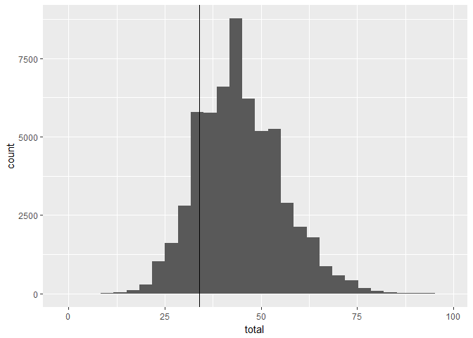
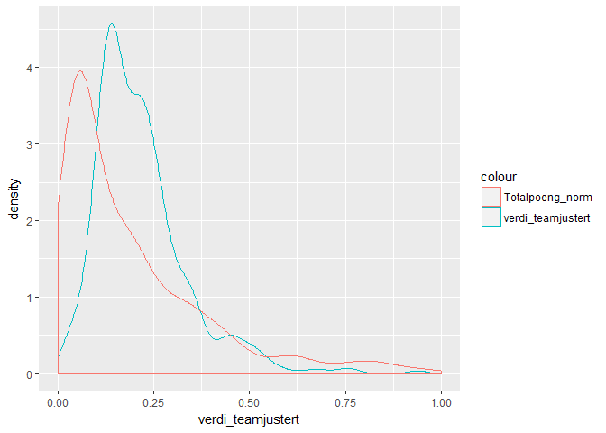
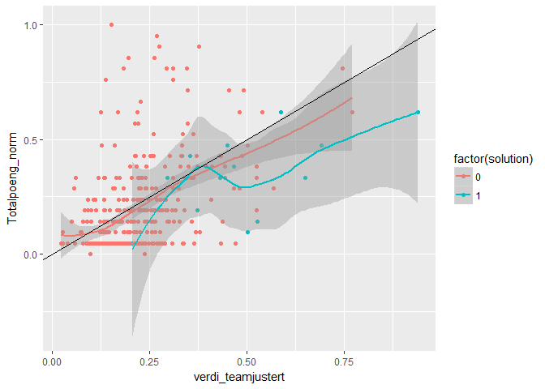

Fantasy-eliteserie - modellevaluering
================

Ok, 1. april gjorde jeg siste justeringer av [laget mitt](https://github.com/gardenberg/fantasy_fotball/blob/master/lagsammensetning.md). Nå er de to første rundene spilt.

Hva var laget mitt igjen? Jo:

``` r
kable(arrange(select(filter(data_start,solution==1),id,navn,posisjon,team_navn,verdi_teamjustert),posisjon,desc(verdi_teamjustert)),caption="Første 15 spillere")
```

|   id| navn                     | posisjon | team\_navn |  verdi\_teamjustert|
|----:|:-------------------------|:---------|:-----------|-------------------:|
|  194| Nicklas Bendtner         | Angrep   | RBK        |           0.9388889|
|  365| Mohammed Abdellaoue      | Angrep   | VIF        |           0.5254672|
|  258| Fredrik Flo              | Angrep   | SOG        |           0.2051946|
|  146| Espen Ruud               | Forsvar  | ODD        |           0.6502138|
|  299| Lars-Christopher Vilsvik | Forsvar  | SIF        |           0.5014311|
|  298| Jonathan Parr            | Forsvar  | SIF        |           0.4295948|
|   29| Amin Nouri               | Forsvar  | BRA        |           0.3526969|
|   31| Ruben Kristiansen        | Forsvar  | BRA        |           0.3318149|
|  169| André Hansen             | Keeper   | RBK        |           0.5861408|
|  144| Sondre Rossbach          | Keeper   | ODD        |           0.4651871|
|  184| Fredrik Midtsjø          | Midtbane | RBK        |           0.6913667|
|  132| Sander Svendsen          | Midtbane | MOL        |           0.4487115|
|  143| Etzaz Hussain            | Midtbane | MOL        |           0.3719081|
|   41| Sivert Heltne Nilsen     | Midtbane | BRA        |           0.2960077|
|  154| Ardian Gashi             | Midtbane | ODD        |           0.2828410|

Dataene med poengsummene til de nå ca. 61 000 lagene ser ut til å være tilgjengelig. Til nå har jeg bare klart å få dem ut 50 av gangen - dvs. at en frekk loop spør 1200 ganger, over 1.5 time for å unngå at VG får DDOs-følelse.

Her ser vi at med 34 poeng lå jeg på 48 416 plass etter første runde. Det er mange delte plasseringer, men det er altså noen tusen lagkonfigurasjoner som er bedre.

    ## `stat_bin()` using `bins = 30`. Pick better value with `binwidth`.



Det trengs et par runder til før jeg vil begynne å se på måter å finne gode overganger på, men det kan være interessant å sette opp en kjapp vurdering av hvordan modellen for å finne det beste laget gjorde det. Verdi\_teamjustert var min indikator for poeng. Er fordelinga av den lik fordelinga av totalpoengene så langt? Ved å normalisere totalpoengsummen på samme vis som verdi-indikatoren kan vi sammenlikne fordelingene.



Fordelinga var (etter første runde) ikke helt lik. Indikatoren heller mer mot høyre, mens totalpoengene er mye mer høyreskjev og har mange i den lave enden av fordelinga. Dette er kanskje naturlig - etter hvert vil enkelte formodentlig bevege seg mer mot høyre og høyere poengsummer. Den trenden blir synlig allerede etter andre runde - totalpoengene begynner å bevege seg mot høyre.

Er det sammenheng mellom verdien jeg predikerte for hver enkelt spiller og poengene de til nå har samla inn? Verdi-indikatoren var en lineær modell av fire variabler. Totalpoeng-indikatoren kan ikke sies å være korrelert med input-faktorene på samme måte. Indikatoren på lagstyrke ser til og med ut til å være negativt korrelert med poengene.

``` r
modell_1 = lm(verdi_teamjustert~now_cost_norm+selected_norm+poeng_norm+verdi_meanteam_norm,data=df)
summary(modell_1)
```

    ## 
    ## Call:
    ## lm(formula = verdi_teamjustert ~ now_cost_norm + selected_norm + 
    ##     poeng_norm + verdi_meanteam_norm, data = df)
    ## 
    ## Residuals:
    ##        Min         1Q     Median         3Q        Max 
    ## -8.251e-16 -2.324e-16  3.910e-18  2.233e-16  6.713e-16 
    ## 
    ## Coefficients:
    ##                       Estimate Std. Error    t value Pr(>|t|)    
    ## (Intercept)         -5.843e-17  4.310e-17 -1.356e+00    0.176    
    ## now_cost_norm        3.000e-01  1.204e-16  2.493e+15   <2e-16 ***
    ## selected_norm        3.000e-01  1.439e-16  2.084e+15   <2e-16 ***
    ## poeng_norm           2.000e-01  9.844e-17  2.032e+15   <2e-16 ***
    ## verdi_meanteam_norm  2.000e-01  7.661e-17  2.611e+15   <2e-16 ***
    ## ---
    ## Signif. codes:  0 '***' 0.001 '**' 0.01 '*' 0.05 '.' 0.1 ' ' 1
    ## 
    ## Residual standard error: 3.013e-16 on 396 degrees of freedom
    ## Multiple R-squared:      1,  Adjusted R-squared:      1 
    ## F-statistic: 1.664e+31 on 4 and 396 DF,  p-value: < 2.2e-16

``` r
modell_2 = lm(Totalpoeng_norm~now_cost_norm+selected_norm+poeng_norm+verdi_meanteam_norm,data=df)
summary(modell_2)
```

    ## 
    ## Call:
    ## lm(formula = Totalpoeng_norm ~ now_cost_norm + selected_norm + 
    ##     poeng_norm + verdi_meanteam_norm, data = df)
    ## 
    ## Residuals:
    ##      Min       1Q   Median       3Q      Max 
    ## -0.39312 -0.08377 -0.04442  0.04222  0.85938 
    ## 
    ## Coefficients:
    ##                     Estimate Std. Error t value Pr(>|t|)    
    ## (Intercept)          0.04741    0.02390   1.984   0.0480 *  
    ## now_cost_norm        0.35140    0.06673   5.266 2.30e-07 ***
    ## selected_norm        0.32885    0.07981   4.120 4.61e-05 ***
    ## poeng_norm           0.13172    0.05458   2.413   0.0163 *  
    ## verdi_meanteam_norm  0.01625    0.04248   0.383   0.7023    
    ## ---
    ## Signif. codes:  0 '***' 0.001 '**' 0.01 '*' 0.05 '.' 0.1 ' ' 1
    ## 
    ## Residual standard error: 0.1671 on 396 degrees of freedom
    ## Multiple R-squared:  0.2695, Adjusted R-squared:  0.2621 
    ## F-statistic: 36.52 on 4 and 396 DF,  p-value: < 2.2e-16

``` r
qplot(verdi_teamjustert,Totalpoeng_norm,data=df,color=factor(solution),geom=c("point","smooth")) +
        geom_abline(intercept = 0, slope = 1)
```

    ## `geom_smooth()` using method = 'loess'



Det samme ser vi når vi plotter verdi-indikatoren mot totalpoengene. Dette så, per 2. april, ikke spesielt lovende ut. Det er en viss positiv sammenheng, men ikke stor - og langt ifra en perfekt linje. I tråd med fordelinga vi så over, ser vi at de fleste har fått færre poeng enn jeg antok. Etter andre runde retter imidlertid linja for alle spillerne seg opp - og særlig kostnad og popularitet henger bedre sammen med poengsummen. Dette gjelder imidlertid mindre for spillerne jeg valgte ut.

Hvordan vurdere løsninga fra lp\_solve opp mot andre løsninger? En måte ville vært å finne alle gyldige løsninger (alle gyldige kombinasjoner er kanskje et bedre navn på det - ikke bare de med høyest poengsum, men alle som oppfyller begrensningene), og sammenliknet disse på poeng. Enn så lenge har jeg ikke funnet en måte å liste ut alle gyldige kombinasjoner på, uten å kode masse - så det står vi over. I stedet ser vi på hva som nå ville vært det beste laget.

``` r
# OBJECTIVE FUNCTION: popularitet, pris og lagstyrke
# antar at det er dette som skal maksimeres (eller minimeres) - 
f.obj <- df_spillerdata$total_points

x <- lp ("max", f.obj, f.con, f.dir, f.rhs, all.bin=TRUE)
x
```

    ## Success: the objective function is 228

``` r
kable(arrange(df_spillerdata[which(x$solution==1),c(1,3,50,51,11,22,5,32)],element_type,desc(total_points)))
```

|   id| web\_name       |  element\_type|  team|  now\_cost| selected\_by\_percent | status |  total\_points|
|----:|:----------------|--------------:|-----:|----------:|:----------------------|:-------|--------------:|
|  169| Hansen          |              1|     8|         55| 32.0                  | a      |             12|
|  116| Linde           |              1|     6|         55| 8.7                   | a      |              8|
|  223| Rosted          |              2|    10|         57| 16.9                  | a      |             19|
|  150| Grøgaard        |              2|     7|         56| 8.1                   | a      |             16|
|   33| Ròlantsson      |              2|     2|         60| 8.4                   | a      |             15|
|  127| Gregersen       |              2|     6|         51| 7.1                   | a      |             15|
|  323| Wangberg        |              2|    14|         50| 9.8                   | a      |             13|
|  107| Ifeanyi Matthew |              3|     5|         61| 11.8                  | a      |             16|
|  181| Jensen          |              3|     8|        105| 28.3                  | a      |             16|
|  228| Trondsen        |              3|    10|         71| 13.6                  | a      |             16|
|  187| Jevtovic        |              3|     8|         77| 11.7                  | a      |             14|
|   37| Haugen          |              3|     2|         90| 8.4                   | a      |             12|
|   65| Shuaibu         |              4|     3|         51| 6.5                   | a      |             20|
|   64| Gytkjær         |              4|     3|         76| 15.6                  | a      |             18|
|  278| Omoijuanfo      |              4|    12|         70| 21.2                  | a      |             18|

``` r
df_spillerdata$solution = x$solution
```

Oppsummert
----------

Etter første runde ser det ikke ut til at modellen traff videre bra. Det kan derfor bli behov for å gjøre justeringer utover sesongen.
